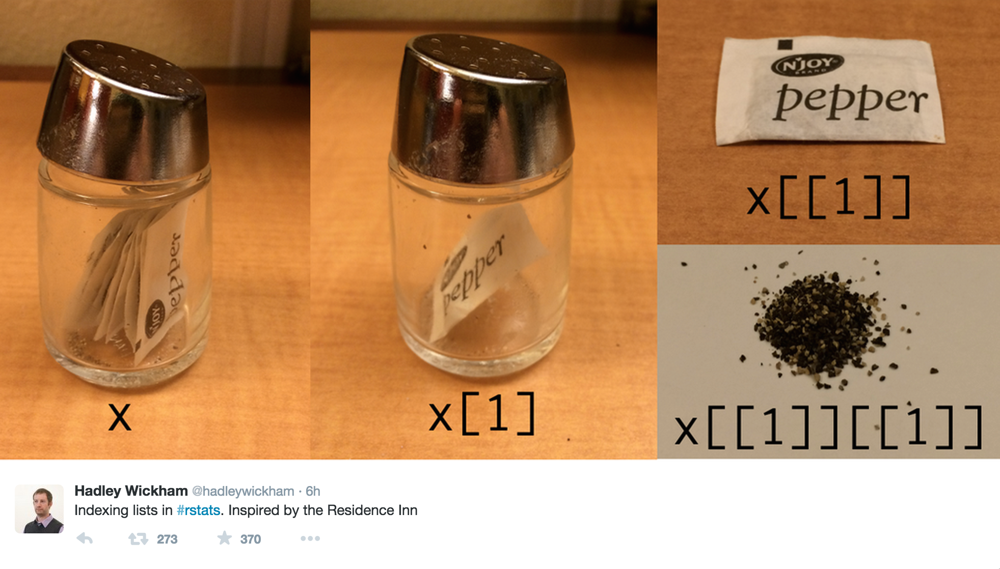

```{r setup}
#| include: false
options(
  width=80
)
```

# Matrices and Arrays


## Matrices

R supports the creation of 2d matrix data structures using atomic vector types. 

Generally these are formed via a call to `matrix()`.

:::: {.columns .small}
::: {.column width='50%'}
```{r}
matrix(1:4, nrow=2, ncol=2)
matrix(c(TRUE, FALSE), 2, 2)
```
:::
::: {.column width='50%'}
```{r}
matrix(LETTERS[1:6], 2)
matrix(6:1 / 2, ncol = 2)
```
:::
::::


## Data ordering

Matrices in R use column major ordering (data is stored by *column*).

:::: {.columns .xsmall}
::: {.column width='50%'}
```{r}
(m = matrix(1:6, nrow=2, ncol=3))
c(m)
```
:::
::: {.column width='50%'}
```{r}
(n = matrix(1:6, nrow=3, ncol=2))
c(n)
```
:::
::::

. . .

We can populate a matrix by row, but the data is still stored by column.

:::: {.columns .xsmall}
::: {.column width='50%'}
```{r}
(x = matrix(1:6, nrow=2, ncol=3, byrow = TRUE))
c(x)
```
:::
::: {.column width='50%'}
```{r}
(y = matrix(1:6, nrow=3, ncol=2, byrow=TRUE))
c(y)
```
:::
::::

::: {.aside}
The use of `c()` here "flattens" the matrix by stripping its dimensions
:::


## Matrix structure

::: {.small}
```{r}
m = matrix(1:4, ncol=2, nrow=2)
```
:::

. . .

:::: {.columns .small}
::: {.column width='50%'}
```{r}
typeof(m)
mode(m)
```
:::
::: {.column width='50%'}
```{r}
class(m)
attributes(m)
```
:::
::::

. . .

Matrices (and arrays) are just atomic vectors with a `dim` attribute attached. They do not have an explicit class attribute, but instead have implicit class.

:::: {.columns .small}
::: {.column width='50%'}
```{r}
n = letters[1:6]
dim(n) = c(2L, 3L)
n
```
:::
::: {.column width='50%'}
```{r}
o = letters[1:6]
attr(o,"dim") = c(2L, 3L)
o
```
:::
::::


## Demo - S3 w/ matrices

:::: {.columns .xsmall}
::: {.column width='60%' }
```{r}
#| eval: false
report = function(x) {
  UseMethod("report")
}
report.default = function(x) {
  paste0("Class ", class(x)," not supported.")
}
report.double = function(x) {
  "I'm a double!"
}
report.numeric = function(x) {
  "I'm a numeric!"
}
report.matrix = function(x) {
  "I'm a matrix!"
}
report.array = function(x) {
  "I'm an array!"
}
```
:::
::: {.column width='40%' }
```{r}
#| eval: false

#rm(report.double)
#rm(report.numeric)
#rm(report.matrix)
#rm(report.array)

report(matrix(1))
```

:::
::::


## Arrays

Arrays are just an $n$-dimensional extension of matrices and are defined by adding the appropriate dimension sizes.

:::: {.columns .small}
::: {.column width='50%'}
```{r}
array(1:8, dim = c(2,2,2))
```
:::
::: {.column width='50%'}
```{r}
array(letters[1:6], dim = c(1,2,3))
```
:::
::::

## Arrays & `class()`

A 2d array will have class `c("matrix","array")` while 1d or >2d will only have class `"array"`

:::: {.columns .small}
::: {.column width='50%'}
```{r}
class(array(1, c(1,1)))
```
:::
::: {.column width='50%'}
```{r}
class(array(1, c(1,1,1)))
```
:::
::::

. . .

:::: {.columns .small}
::: {.column width='50%'}
```{r}
class(array(1, c(1)))
```
:::
::: {.column width='50%'}
```{r}
class(array(1, c(1,1,1,1)))
```
:::
::::


# Data Frames

## Data Frames

A data frame is how R handles heterogeneous tabular data (i.e. a table of rows and columns) and is one of the most commonly used data structure in R.


::: {.small}
```{r}
(df = data.frame(
  x = 1:3, 
  y = c("a", "b", "c"),
  z = c(TRUE)
))
```
:::

. . .

R represents data frames using a *list* of equal length *vectors*.

::: {.small}
```{r}
str(df)
```
:::


## Data Frame Structure

:::: {.columns .small}
::: {.column width='50%'}
```{r}
typeof(df)
class(df)
attributes(df)
```
:::
::: {.column width='50%' .fragment}
```{r}
str(unclass(df))
```
:::
::::


## Build your own data.frame

::: {.small}
```{r}
df = list(x = 1:3, y = c("a", "b", "c"), z = c(TRUE, TRUE, TRUE))
```
:::

. . .

:::: {.columns .small}
::: {.column width='50%'}
```{r}
attr(df,"class") = "data.frame"
df
```
:::
::: {.column width='50%'}
```{r}
attr(df,"row.names") = 1:3
df
```
:::
::::

. . .

::: {.small}
```{r}
str(df)
is.data.frame(df)
```
:::


## Strings (Characters) vs Factors

Previous to R v4.0, the default behavior of data frames was to convert character data into factors. Sometimes this was useful, but mostly it wasn't.

This behavior is controlled via the `stringsAsFactors` argument to `data.frame` (and related functions like `read.csv`, `read.table`, etc.).

:::: {.columns .small}
::: {.column width='50%'}
```{r}
(df = data.frame(
  x = 1:3, y = c("a", "b", "c"), 
  stringsAsFactors = TRUE))
str(df)
```
:::

::: {.column width='50%'}
```{r}
(df = data.frame(
  x = 1:3, y = c("a", "b", "c"), 
  stringsAsFactors = FALSE))
str(df)
```
:::
::::


## Length Coercion

When creating a data frame from different vectors, the lengths of the component vectors will be coerced to match. However, if they are not multiples of each other then there will be an error (other previous forms of length coercion would produce a warning for this case).


::: {.small}
```{r}
#| error: true
data.frame(x = 1:3, y = c("a"))
```
:::

. . .

::: {.small}
```{r}
#| error: true
data.frame(x = 1:3, y = c("a","b"))
```
:::

. . .

::: {.small}
```{r}
#| error: true
data.frame(x = 1:3, y = character())
```
:::


# Subsetting

## Subsetting in R

R has three subsetting operators (`[`, `[[`, and `$`). The behavior of these operators depends on the object (class) they are being used with.

<br/>

In general there are 6 different types of subsetting that can be performed:

:::: {.columns}
::: {.column width='50%'}
* Positive integer

* Negative integer

* Logical value
:::
::: {.column width='50%'}
* Empty / NULL

* Zero valued

* Character value (names)
:::
::::

## Positive Integer subsetting

Returns elements at the given location(s)


:::: {.columns .small}
::: {.column width='50%'}
```{r}
x = c(1,4,7)
```
```{r}
x[1]
x[c(1,3)]
x[c(1,1)]
x[c(1.9,2.1)]
```
:::

::: {.column width='50%'}
```{r}
y = list(1,4,7)
```

```{r}
str( y[1] )
str( y[c(1,3)] )
str( y[c(1,1)] )
str( y[c(1.9,2.1)] )
```
:::
::::

::: {.aside}
Note - R uses a 1-based indexing scheme
:::

## Negative Integer subsetting

Excludes elements at the given location(s)

:::: {.columns .small}
::: {.column width='50%'}
```{r}
#| error: true
x = c(1,4,7)
```

```{r}
#| error: true
x[-1]
x[-c(1,3)]
x[c(-1,-1)]
```
:::
::: {.column width='50%'}
```{r}
#| error: true
y = list(1,4,7)
```

```{r}
#| error: true
str( y[-1] )
str( y[-c(1,3)] )
```
:::
::::

. . .

::: {.small}
```{r}
#| error: true
x[c(-1,2)]
y[c(-1,2)]
```
:::

## Logical Value Subsetting

Returns elements that correspond to `TRUE` in the logical vector. Length of the logical vector is coerced to be the same as the vector being subsetted.


:::: {.columns .small}
::: {.column width='50%'}
```{r}
x = c(1,4,7,12)
```
```{r}
#| error: true
x[c(TRUE,TRUE,FALSE,TRUE)]
x[c(TRUE,FALSE)]
```
:::
::: {.column width='50%'}
```{r}
#| error: true
y = list(1,4,7,12)
```
```{r}
#| error: true
str( y[c(TRUE,TRUE,FALSE,TRUE)] )
str( y[c(TRUE,FALSE)] )
```
:::
::::

. . .

:::: {.columns .small}
::: {.column width='50%'}
```{r}
#| error: true
x[x %% 2 == 0]
```
:::
::: {.column width='50%'}
```{r}
#| error: true
str( y[y %% 2 == 0] )
```
:::
::::


## Empty Subsetting

Returns the original vector, this is not the same as subsetting with `NULL`

:::: {.columns .small}
::: {.column width='50%'}
```{r}
x = c(1,4,7)
```
```{r}
x[]
x[NULL]
```
:::
::: {.column width='50%'}
```{r}
y = list(1,4,7)
```
```{r}
str(y[])
str(y[NULL])
```
:::
::::


## Zero subsetting

Returns an empty vector (of the same type), this is the same as subsetting with `NULL`

:::: {.columns .small}
::: {.column width='50%'}
```{r}
x = c(1,4,7)
```

```{r}
x[0]
```
:::
::: {.column width='50%'}
```{r}
y = list(1,4,7)
str(y[0])
```
:::
::::

. . .

`0`s can be mixed with either positive or negative integers for subsetting, but they are ignored in both cases.


:::: {.columns .small}
::: {.column width='50%'}
```{r}
x[c(0,1)]
y[c(0,1)]
```
:::
::: {.column width='50%'}
```{r}
x[c(0,-1)]
y[c(0,-1)]
```
:::
::::


## Character subsetting

If the vector has names, selects elements whose names correspond to the values in the name vector.

:::: {.columns .small}
::: {.column width='50%'}
```{r}
x = c(a=1, b=4, c=7)
```

```{r}
x["a"]
x[c("a","a")]
x[c("b","c")]
```
:::
::: {.column width='50%'}
```{r}
y = list(a=1,b=4,c=7)
```

```{r}
str(y["a"])
str(y[c("a","a")])
str(y[c("b","c")])
```
:::
::::

## Out of bounds

:::: {.columns .small}
::: {.column width='50%'}
```{r}
x = c(1,4,7)
```

```{r}
x[4]
x[-4]
x["a"]
x[c(1,4)]
```
:::
::: {.column width='50%'}
```{r}
y = list(1,4,7)
```
```{r}
str(y[4])
str(y[-4])
str(y["a"])
str(y[c(1,4)])
```
:::
::::

## Missing values

:::: {.columns .small}
::: {.column width='50%'}
```{r}
x = c(1,4,7)
```
```{r}
x[NA]
x[c(1,NA)]
```
:::
::: {.column width='50%'}
```{r}
y = list(1,4,7)
```
```{r}
str(y[NA])
str(y[c(1,NA)])
```
:::
::::

## NULL and empty vectors (length 0)

This final type of subsetting follows the rules for length coercion with a 0-length vector (i.e. the vector being subset gets coerced to having length 0 if the subsetting vector has length 0)

:::: {.columns .small}
::: {.column width='50%'}
```{r}
x = c(1,4,7)
```
```{r}
x[NULL]
x[integer()]
x[character()]
```
:::
::: {.column width='50%'}
```{r}
y = list(1,4,7)
```
```{r}
y[NULL]
y[integer()]
y[character()]
```
:::
::::


## Subsetting and assignment

Subsets can also be used with assignment to update specific values within an object (in-place).

::: {.small}
```{r}
x = c(1, 4, 7, 9, 10, 15)
```
:::

. . .

::: {.small}
```{r}
x[2] = 2
x
```
:::

. . .

::: {.small}
```{r}
x %% 2 != 0
```
:::

. . .

::: {.small}
```{r}
x[x %% 2 != 0] = (x[x %% 2 != 0] + 1) / 2
x
```
:::

## More assignment

::: {.columns .small}
::: {.column}
```{r}
x[c(1,1)] = c(2,3)
x
```

```{r}
x = 1:6
```

```{r}
x[c(2,NA)] = 1
x
```

::: {.fragment}
```{r}
x = 1:6
```
```{r}
x[c(-1,-2)] = 3
x
```
:::
:::
::: {.column .fragment}
```{r}
x = 1:6
```
```{r}
x[c(TRUE,NA)] = 1
x
```


::: {.fragment}
```{r}
x = 1:6
```
```{r}
x[] = 1:3
x
```
:::
:::
:::


# The other subset operators <br/> `[[` and `$`


## Atomic vectors - [ vs. [[

`[[` subsets like `[` except it can only subset for a *single* value

::: {.small}
```{r}
#| error: true
x = c(a=1,b=4,c=7)
```

```{r}
x[1]
```
:::

. . .

::: {.small}
```{r}
#| error: true
x[[1]]
```
:::

. . .

::: {.small}
```{r}
#| error: true
x[["a"]]
```
:::

. . .

::: {.small}
```{r}
#| error: true
x[[1:2]]
```
:::

. . .

::: {.small}
```{r}
#| error: true
x[[TRUE]]
```
:::

## Generic Vectors (lists) - [ vs. [[

Subsets a single value, but returns the value - not a list containing that value. Multiple values are interpreted as nested subsetting.

::: {.small}
```{r}
#| error: true
y = list(a=1, b=4, c=7:9)
```
:::

:::: {.columns .small}
::: {.column width='50%'}
```{r}
#| error: true
y[2]
```
:::
::: {.column width='50%'}
```{r}
#| error: true
str( y[2] )
```
:::
::::

. . .

::: {.small}
```{r}
#| error: true
y[[2]]
y[["b"]]
y[[1:2]]
y[[2:1]]
```
:::

## Hadley's Analogy (1)

```{r}
#| echo: false
#| fig-align: center
#| out-width: 37%
knitr::include_graphics("imgs/list_train1.png")
```
. . .
```{r}
#| echo: false
#| fig-align: center
#| out-width: 37%
knitr::include_graphics("imgs/list_train2.png")
```
. . .
```{r}
#| echo: false
#| fig-align: center
#| out-width: 37%
knitr::include_graphics("imgs/list_train3.png")
```


::: {.aside}
From Advanced R - [Chapter 4.3](https://adv-r.hadley.nz/subsetting.html#subset-single)
:::

## Hadley's Analogy (2)

```{r}
#| echo: false
#| fig-align: center
#| out-width: 80%

```

## [[ vs. $

`$` is equivalent to `[[` but it only works for name based subsetting of *lists* (it also uses partial matching for names)

::: {.small}
```{r}
#| error: true
x = c("abc"=1, "def"=5)
```

```{r}
#| error: true
x$abc
```
:::

. . .

::: {.small}
```{r}
y = list("abc"=1, "def"=5)
```

```{r}
y[["abc"]]
y$abc
y$d
```
:::

## A common error

Why does the following code not work?

```{r}
#| error: true
x = list(abc = 1:10, def = 10:1)
y = "abc"
```

:::: {.columns}
::: {.column width='50%'}
```{r}
x[[y]]
```
:::
::: {.column width='50%'}
```{r}
x$y
```
:::
::::

. . .

The expression `x$y` gets interpreted as `x[["y"]]` by R, note the inclusion of the `"`s, this is not the same as the expression `x[[y]]`.

