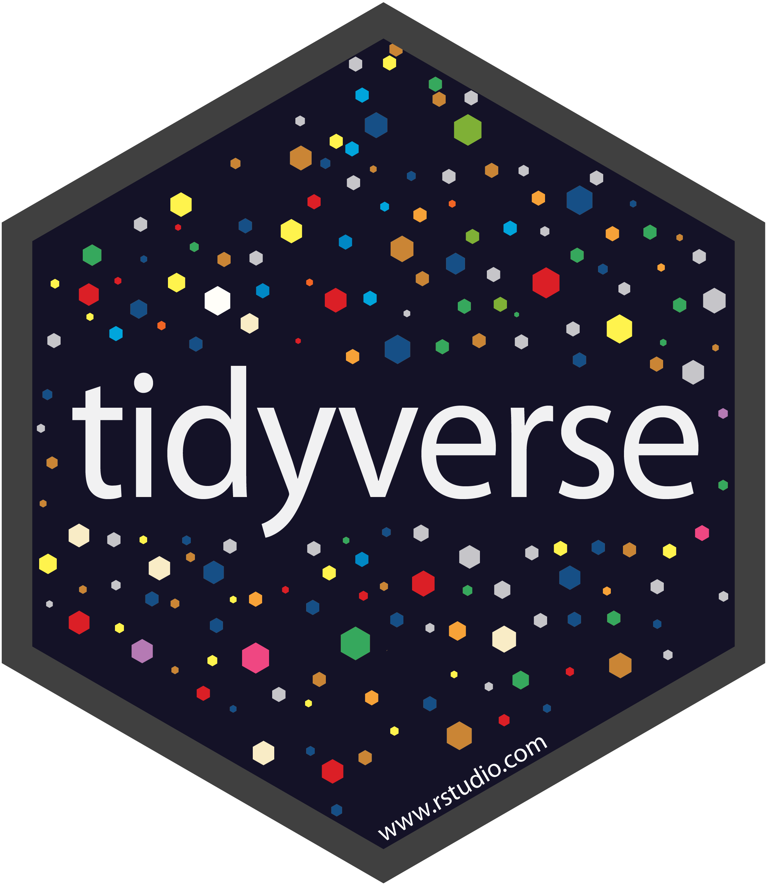
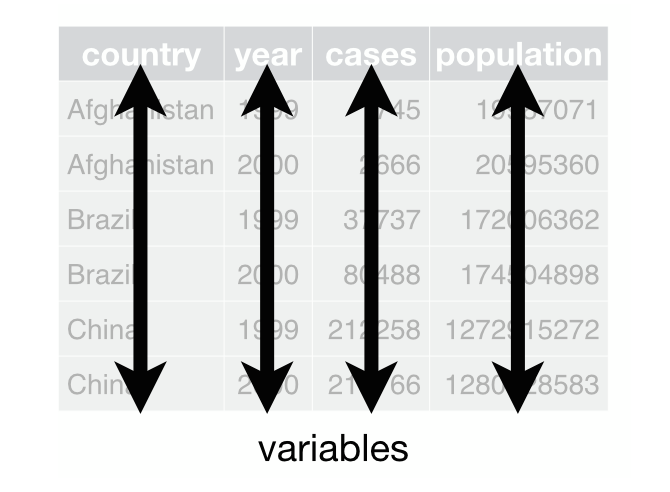
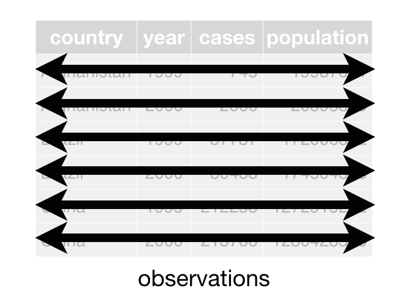
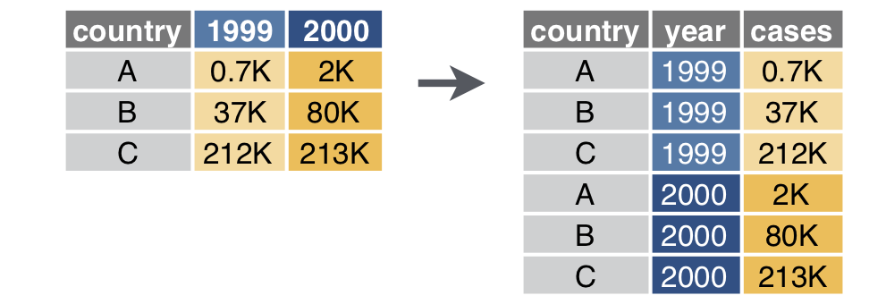
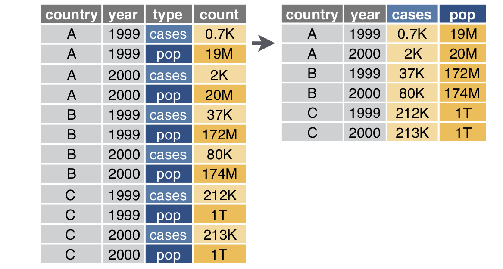
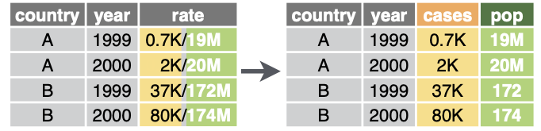
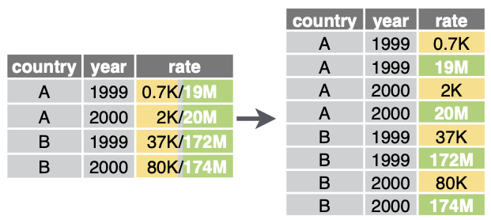
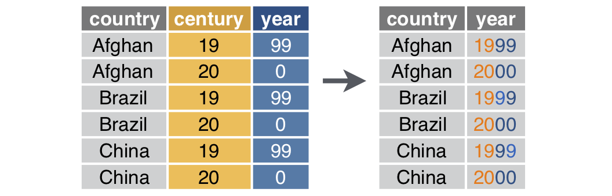

```{r setup}
#| message: False
#| warning: False
#| include: False
options(
  width=70
)

library(magrittr)
```

#

{fig-align="center" width="40%"}


## Tidy data

:::: {.columns}
::: {.column width='50%'}
```{r echo=FALSE, out.width="70%", fig.align="center"}

```
:::
::: {.column width='50%'}
```{r echo=FALSE, out.width="70%", fig.align="center"}

```
:::
::::

```{r echo=FALSE, out.width="30%", fig.align="center"}
knitr::include_graphics('imgs/tidy3.png')
```

::: {.aside}
From R4DS - [tidy data](http://r4ds.had.co.nz/tidy-data.html)
:::

## Tidy vs Untidy

> Happy families are all alike; every unhappy family is unhappy in its own way 
>
> — Leo Tolstoy, Anna Karenina

. . .

::: {.small}
```{r}
#| echo: False
tidyr::billboard[,1:7]
```
:::

::: {.center}
Is this data tidy?
:::

#  {#tibble-logo data-menu-title="tibble"}

{fig-align="center" width="40%"}


## Modern data frames

The tidyverse includes the tibble package that extends data frames to be a bit more modern. The core features of tibbles are a nicer printing method as well as being "lazy".

:::: {.xsmall}
```{r}
library(tibble)
```

```{r include = FALSE}
options(width = 50)
```

:::: {.columns}
::: {.column width='50%'}
```{r}
iris
```
:::
::: {.column width='50%' .fragment}
```{r}
(tbl_iris = as_tibble(iris))
```
:::
::::
::::

```{r include = FALSE}
options(width = 75)
```

## Tibbles are lazy (preserving type)

By default, subsetting tibbles always results in another tibble (`$` or `[[` can still be used to subset for a specific column). 

::: {.small}
```{r}
tbl_iris[1,]
```
:::

. . .

:::: {.columns .small}
::: {.column width='50%'}
```{r}
tbl_iris[,1]
```
:::
::: {.column width='50%' .fragment}
```{r}
head(tbl_iris[[1]])
head(tbl_iris$Species)
```
:::
::::


## Tibbles are lazy (partial matching)

Tibbles do not use partial matching when the `$` operator is used.

:::: {.columns}
::: {.column width='50%'}
```{r}
head( iris$Species )
```
:::
::: {.column width='50%'}
```{r}
head( tbl_iris$Species )
```
:::
::::

. . .

:::: {.columns}
::: {.column width='50%'}
```{r}
head( iris$Sp )
```
:::
::: {.column width='50%'}
```{r}
head( tbl_iris$Sp )
```
:::
::::


## Tibbles are lazy (length coercion)

Only vectors with length 1 will undergo length coercion / recycling - anything else throws an error.

:::: {.columns .small}
::: {.column width='50%'}
```{r}
#| error: True
data.frame(x = 1:4, y = 1)
```
:::
::: {.column width='50%'}
```{r}
#| error: True
tibble(x = 1:4, y = 1)
```
:::
::::

::: {.aside}
All of this `tibble` behavior helps prevent bugs!
:::


. . .

:::: {.columns .medium}
::: {.column width='50%'}
```{r}
#| error: True
data.frame(x = 1:4, y = 1:2)
```
:::
::: {.column width='50%'}
```{r}
#| error: True
tibble(x = 1:4, y = 1:2)
```
:::
::::


## Tibbles and S3

:::: {.columns .small}
::: {.column width='50%'}
```{r}
t = tibble(
  x = 1:3, 
  y = c("A","B","C")
)

class(t)
```
:::
::: {.column width='50%'}
```{r}
d = data.frame(
  x = 1:3, 
  y = c("A","B","C")
)

class(d)
```
:::
::::

. . .


::: {.small}
```{r}
methods(class="tbl_df")
methods(class="tbl")
```
:::

## Tibble support?

Tibbles are just specialized data frames, and will fall back to base data frame methods when needed.

```{r}
d = tibble(
  x = rnorm(100),
  y = 3 + x + rnorm(100, sd = 0.1) 
)
```

```{r}
lm(y~x, data = d)
```


::: {.center .large}
Why did this work?
:::


#

::: {.center .super-giant}
`|>`
:::

::: {.center .xlarge}
R's base pipe
:::


## What is a pipe

> In software engineering, a pipeline consists of a chain of processing elements (processes, threads, coroutines, functions, etc.), arranged so that the output of each 
element is the input of the next;
>
> [Wikipedia - Pipeline (software)](https://en.wikipedia.org/wiki/Pipeline_%28software%29)

. . .

R's base pipe (`|>`) is an infix operator that allows us to link two functions together in a way that is readable from left to right.

The following examples are equivalent:


```r
f(g(x=1, y=2), n=2)
```

```r
g(x=1, y=2) |> f(n=2) 
```

```r
g(x=1, y=2) %>% f(n=2)  # library(magrittr)
```


## Readability

All of the following are fine; it comes down to personal preference. Try to be consistent.

Nested:
```{r, eval=FALSE}
h( g( f(x), y=1), z=1 )
```

Piped:
```{r, eval=FALSE}
f(x) |>
  g(y=1) |>
  h(z=1)
```

Intermediate:
```{r, eval=FALSE}
res = f(x)
res = g(res, y=1)
res = h(res, z=1)
```

## What about other arguments?

Sometimes we want to send our results to a function argument other than first one. In these cases we can refer to the previous result using `_` (as long as the argument is named).

. . .


::: {.small}
```{r}
data.frame(a = 1:3, b = 3:1) |> lm(a~b, data=_)
```
:::

. . .

For non-named arguments we can use an anonymous function.

```{r}
data.frame(a = 1:3, b = 3:1) |> (function(x) x[[1]])()
```


# {#dplyr-logo data-menu-title="dplyr"}

{fig-align="center" width="40%"}


## A Grammar of Data Manipulation

::: {.medium}
dplyr is based on the concepts of functions as verbs that manipulate data frames.

Core single data frame functions / verbs:

* `filter()` / `slice()` - pick rows based on criteria
* `mutate()` / `transmute()` - create or modify columns
* `summarise()` / `count()` - reduce variables to values
* `group_by()` / `ungroup()` - modify other verbs to act on subsets
* `select()` / `rename()` - select columns by name
* `pull()` - grab a column as a vector
* `arrange()` - reorder rows
* `distinct()` - filter for unique rows
* `relocate()` - change column order
* ... (many more)
:::


## dplyr rules

1. First argument is *always* a data frame

2. Subsequent arguments say what to do with the data frame

3. *Always* return a data frame

4. Don't modify in place (how does this affect memory usage?)

5. Magic via non-standard evaluation + lazy evaluation and S3


## Example Data

We will demonstrate dplyr's functionality using the nycflights13 data.

::: {.medium}
```{r message=FALSE}
library(nycflights13)
flights
```
:::

## Example 1

1. How many flights to Los Angeles (LAX) did each of the legacy carriers (AA, UA, DL or US) have in May from JFK, and what was their average duration?

1. What was the shortest flight out of each airport in terms of distance? 

1. Which plane (check the tail numbers) flew out of each New York airport the most?

1. Which 5 days should you consider flying on if you want to have the lowest possible average departure delay?


#  {#tidyr-logo data-menu-title="tidyr"}

```{r setup2}
#| message: False
#| warning: False
#| include: False
options(
  width=80
)

library(tidyverse)
```

{fig-align="center" width="50%"}


# Reshaping data

## Wide vs Long

::: {.center}
{fig-align="center" width="50%"}
:::

::: {.aside}
From [gadenbuie/tidyexplain](https://github.com/gadenbuie/tidyexplain)
:::

## Wide -> Long

{fig-align="center" width="60%"}

::: {.center}
`pivot_longer` (previously `gather` or `reshape2::melt`)
:::

::: {.aside}
From [Data tidying with tidyr](https://raw.githubusercontent.com/rstudio/cheatsheets/main/tidyr.pdf)
:::


## Syntax

::: {.small}
```{r}
#| output-location: column
(d = tibble::tribble(
  ~country, ~"1999",  ~"2000",
        "A", "0.7K",     "2K",
        "B",  "37K",    "80K",
        "C", "212K",   "213K"
))
```
:::

. . .

<br/>

::: {.small}
```{r}
#| code-line-numbers: "|3|4|5"
#| output-location: column
pivot_longer(
  d, 
  cols = "1999":"2000", 
  names_to = "year", 
  values_to = "cases"
)
```
:::


## Long -> Wide

{fig-align="center" width="60%"}

::: {.center}
`pivot_wider` (previously `spread`)
:::

::: {.aside}
From [Data tidying with tidyr](https://raw.githubusercontent.com/rstudio/cheatsheets/main/tidyr.pdf)
:::


## Syntax 

:::: {.columns .xsmall}
::: {.column width='50%'}
```{r}
#| output: false
( d = tibble::tribble(
    ~country, ~year,   ~type, ~count,
         "A",  1999, "cases", "0.7K",
         "A",  1999,   "pop",  "19M",
         "A",  2000, "cases",   "2K",
         "A",  2000,   "pop",  "20M",
         "B",  1999, "cases",  "37K",
         "B",  1999,   "pop", "172M",
         "B",  2000, "cases",  "80K",
         "B",  2000,   "pop", "174M",
         "C",  1999, "cases", "212K",
         "C",  1999,   "pop",   "1T",
         "C",  2000, "cases", "213K",
         "C",  2000,   "pop",   "1T"
  )
)
```
:::
::: {.column width='50%'}
```{r}
#| echo: false
d
```
:::
::::

. . .

:::: {.columns .xsmall}
::: {.column width='50%'}
```{r wider}
#| code-line-numbers: "|3|4|5"
#| eval: false
pivot_wider(
  d, 
  id_cols = country:year, 
  names_from = type, 
  values_from = count
)
```
:::
::: {.column width='50%'}
```{r ref.label="wider"}
#| echo: false
```
:::
::::


## Exercise 1

::: {.small}
The `palmerpenguins` package contains measurement data on various penguin species on islands near Palmer Station in Antarctica. The code below shows the # of each species measured on each of the three islands (missing island, penguin pairs implies that species does not occur on that island).

```{r}
palmerpenguins::penguins |>
  count(island, species)
```

Starting from these data construct a contingency table of counts for island (rows) by species (columns) using the pivot functions we've just discussed.
:::

```{r}
#| echo: false
countdown::countdown(3)
```


## Separate - wider

```{r}
#| echo: false
d = tibble::tribble(
  ~country, ~year, ~rate,
  "A", 1999, "0.7K/19M",
  "A", 2000, "2K/20M",
  "B", 1999, "37K/172M",
  "B", 2000, "80K/174M",
  "C", 1999, "212K/1T",
  "C", 2000, "213K/1T"
)
```

{fig-align="center" width="70%"}

. . .

::: {.small}
```{r}
separate_wider_delim(d, rate, delim = "/", names = c("cases", "pop"))
```
:::

::: {.aside}
From [Data tidying with tidyr](https://raw.githubusercontent.com/rstudio/cheatsheets/main/tidyr.pdf)
:::

## Separate - longer

:::: {.columns}
::: {.column width='50%'}
{fig-align="center" width="100%"}
:::

::: {.column width='50%' .fragment .small}
```{r}
separate_longer_delim(d, rate, delim = "/")
```
:::
::::


::: {.aside}
From [Data tidying with tidyr](https://raw.githubusercontent.com/rstudio/cheatsheets/main/tidyr.pdf)
:::

## Other separates

In previous versions of tidyr there was a single catch-all `separate()` function. This still exists and is available in the package but it is [**superseded**](https://lifecycle.r-lib.org/articles/stages.html).

Other helpful separate functions:

* `separate_longer_position()`

* `separate_wider_position()`

* `separate_wider_regex()`


## Unite

{fig-align="center" width="60%"}

. . .

```{r}
#| echo: false

d = tibble::tribble(
  ~country, ~century, ~year,
  "Afghan",  "19",     "99",
  "Afghan",  "20",     "00",
  "Brazil",  "19",     "99",
  "Brazil",  "20",     "00",
  "China",   "19",     "99",
  "China",   "20",     "00"
)
```

::: {.small}
```{r}
unite(d, century, year, col = "year", sep = "")
```
:::

::: {.aside}
From [Data tidying with tidyr](https://raw.githubusercontent.com/rstudio/cheatsheets/main/tidyr.pdf)
:::


## Example 2 - tidy grades

Is the following data tidy?

```{r}
grades = tibble::tribble(
  ~name,   ~hw_1, ~hw_2, ~hw_3, ~hw_4, ~proj_1, ~proj_2,
  "Alice",    19,    19,    18,    20,      89,      95,
  "Bob",      18,    20,    18,    16,      77,      88,
  "Carol",    18,    20,    18,    17,      96,      99,
  "Dave",     19,    19,    18,    19,      86,      82
)
```

. . .

<br/>

How would we calculate a final score based on the following formula,
$$\text{score} = 0.5\,\frac{\sum_i\text{hw}_i}{80} + 0.5\,\frac{\sum_j\text{proj}_j}{200}$$


## Semi-tidy approach

::: {.small}
```{r}
grades |>
  mutate(
    hw_avg = (hw_1+hw_2+hw_3+hw_4)/4,
    proj_avg = (proj_1+proj_2)/2
  ) |>
  mutate(
    overall = 0.5*(proj_avg/100) + 0.5*(hw_avg/20)
  )
```
:::


## pivot_longer (Wide -> Long)

::: {.medium}
```{r}
#| output-location: column
tidyr::pivot_longer(
  grades, 
  cols = hw_1:proj_2, 
  names_to = "assignment", 
  values_to = "score"
)
```
:::

## Split type and id

::: {.small}
```{r}
#| output-location: column
tidyr::pivot_longer(
  grades, 
  cols = hw_1:proj_2, 
  names_to = c("type", "id"), 
  names_sep = "_", 
  values_to = "score"
)
```
:::


## Tidy approach?

::: {.small}
```{r}
#| output-location: column
grades |>
  tidyr::pivot_longer(
    cols = hw_1:proj_2, 
    names_to = c("type", "id"),
    names_sep = "_", 
    values_to = "score"
  ) |> 
  summarize(
    total = sum(score),
    .by = c(name, type)
  )
```
:::

## pivot_wider - (Long -> Wide)

::: {.small}
```{r}
#| output-location: column
grades |>
  tidyr::pivot_longer(
    cols = hw_1:proj_2, 
    names_to = c("type", "id"), 
    names_sep = "_", 
    values_to = "score"
  ) |> 
  summarize(
    total = sum(score),
    .by = c(name, type)
  ) |>
  tidyr::pivot_wider(
    names_from = type, 
    values_from = total
  )
```
:::

## Wrapping up

::: {.small}
```{r}
#| output-location: column
final_grades = grades |>
  tidyr::pivot_longer(
    cols = hw_1:proj_2, 
    names_to = c("type", "id"), 
    names_sep = "_", 
    values_to = "score"
  ) |> 
  summarize(
    total = sum(score),
    .by = c(name, type)
  ) |>
  tidyr::pivot_wider(
    names_from = type, 
    values_from = total
  ) |>
  mutate(
    score = 0.5*(hw/80) + 
            0.5*(proj/200)
  )

final_grades
```
:::

