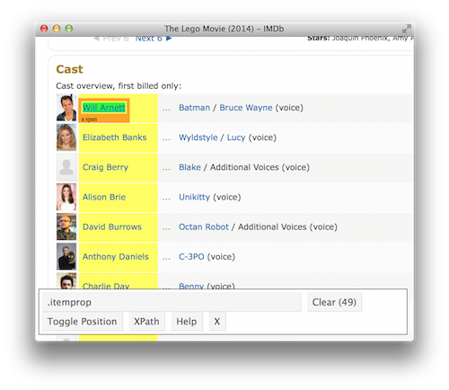
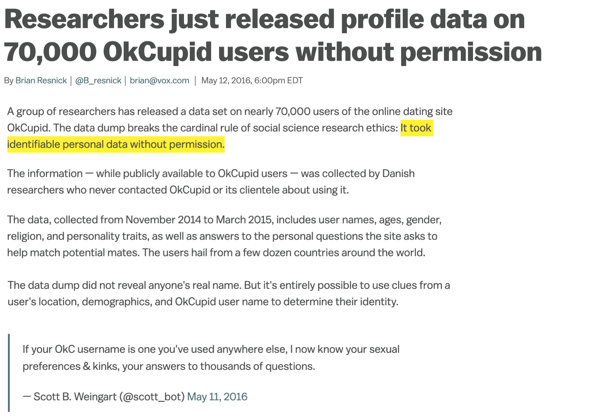
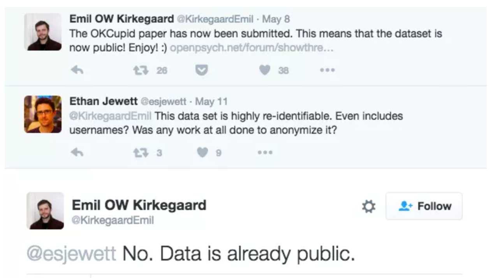

```{r setup}
#| message: False
#| warning: False
#| include: False
options(
  width=80
)

knitr::opts_chunk$set(
  fig.align = "center", fig.retina = 2, dpi = 150,
  out.width = "100%"
)

library(magrittr)
library(rvest)
```

#

```{r}
#| echo: false
#| out.width: "40%"
knitr::include_graphics("imgs/hex-rvest.png")
```


## Hypertext Markup Language

Most of the data on the web is still largely available as HTML - while it is structured (hierarchical) it often is not available in a form useful for analysis (flat / tidy).

::: {.small}

```html
<html>
  <head>
    <title>This is a title</title>
  </head>
  <body>
    <p align="center">Hello world!</p>
    <br/>
    <div class="name" id="first">John</div>
    <div class="name" id="last">Doe</div>
    <div class="contact">
      <div class="home">555-555-1234</div>
      <div class="home">555-555-2345</div>
      <div class="work">555-555-9999</div>
      <div class="fax">555-555-8888</div>
    </div>
  </body>
</html>
```

:::


## rvest

::: {.medium}
`rvest` is a package from the tidyverse that makes basic processing and manipulation of HTML data straightforward. It provides high level functions for interacting with html via the xml2 library.

Core functions:

* `read_html()` - read HTML data from a url or character string.

* `html_elements()` / ~~`html_nodes()`~~ - select specified elements from the HTML document using CSS selectors (or xpath).

* `html_element()` / ~~`html_node()`~~ - select a single element from the HTML document using CSS selectors (or xpath).

* `html_table()` - parse an HTML table into a data frame.

* `html_text()` / `html_text2()` - extract tag's text content.

* `html_name()` - extract a tag/element's name(s).

* `html_attrs()` - extract all attributes.

* `html_attr()` - extract attribute value(s) by name.
:::

## html, rvest, & xml2

:::: {.columns .xsmall}
::: {.column width='50%'}
```{r}
html = 
'<html>
  <head>
    <title>This is a title</title>
  </head>
  <body>
    <p align="center">Hello world!</p>
    <br/>
    <div class="name" id="first">John</div>
    <div class="name" id="last">Doe</div>
    <div class="contact">
      <div class="home">555-555-1234</div>
      <div class="home">555-555-2345</div>
      <div class="work">555-555-9999</div>
      <div class="fax">555-555-8888</div>
    </div>
  </body>
</html>'
```
:::

::: {.column width='50%'}
```{r}
read_html(html)
```
:::
::::


## Selecting elements

::: {.small}
```{r}
read_html(html) |> html_elements("p")
```
:::


. . .

::: {.small}
```{r}
read_html(html) |> html_elements("p") |> html_text()
```
:::

. . .

::: {.small}
```{r}
read_html(html) |> html_elements("p") |> html_name()
```
:::


. . .

::: {.small}
```{r}
read_html(html) |> html_elements("p") |> html_attrs()
```
:::

. . .

::: {.small}
```{r}
read_html(html) |> html_elements("p") |> html_attr("align")
```
:::


## More selecting tags

::: {.small}
```{r}
read_html(html) |> html_elements("div")
```
:::

. . .

::: {.small}
```{r}
read_html(html) |> html_elements("div") |> html_text()
```
:::


## Nesting tags

::: {.small}
```{r}
read_html(html) |> html_elements("body div")
```
:::


. . .

::: {.small}
```{r}
read_html(html) |> html_elements("body>div")
```
:::


##


```{r}
read_html(html) |> html_elements("body div div")
```

## CSS selectors

::: {.medium}
We will be using a tool called selector gadget to help us identify the html elements of interest - it does this by constructing a CSS selector which can be used to subset the html document.

Some examples of basic selector syntax is below,
:::

::: {.small}

Selector          |  Example         | Description
:-----------------|:-----------------|:--------------------------------------------------
.class            |  `.title`        | Select all elements with class="title"
#id               |  `#name`         | Select all elements with id="name"
element           |  `p`             | Select all &lt;p&gt; elements
element element   |  `div p`         | Select all &lt;p&gt; elements inside a &lt;div&gt; element
element>element   |  `div > p`       | Select all &lt;p&gt; elements with &lt;div&gt; as a parent
[attribute]       |  `[class]`       | Select all elements with a class attribute
[attribute=value] |  `[class=title]` | Select all elements with class="title"

:::

::: {.medium}
There are also a number of additional combinators and pseudo-classes that improve flexibility, see examples [here](https://www.w3schools.com/cssref/css_selectors.asp).
:::

::: {.aside}
`html_elements()` also supports [XPath](https://www.w3schools.com/xml/xpath_intro.asp) selectors as an alternative to CSS selectors, though we will prefer CSS selectors in this course.
:::


## CSS classes and ids

```{r}
read_html(html) |> html_elements(".name")
```


. . .


```{r}
read_html(html) |> html_elements("div.name")
```


. . .


```{r}
read_html(html) |> html_elements("#first")
```


## Mixing it up

```{r}
read_html(html) |> html_elements("[align]")
```

. . .

```{r}
read_html(html) |> html_elements(".contact div")
```


## `html_text()` vs `html_text2()`

::: {.small}
```{r}
html = read_html(
  "<p>  
    This is the first sentence in the paragraph.
    This is the second sentence that should be on the same line as the first sentence.<br>This third sentence should start on a new line.
  </p>"
)
```
:::


. . .

::: {.small}
```{r}
html |> html_text()
html |> html_text2()
```
:::

##

```{r}
html |> html_text() |> cat(sep="\n")
html |> html_text2() |> cat(sep="\n")
```


## html tables

:::: {.columns .xsmall}
::: {.column width='65%'}
```{r}
html_table = 
'<html>
  <head>
    <title>This is a title</title>
  </head>
  <body>
    <table>
      <tr> <th>a</th> <th>b</th> <th>c</th> </tr>
      <tr> <td>1</td> <td>2</td> <td>3</td> </tr>
      <tr> <td>2</td> <td>3</td> <td>4</td> </tr>
      <tr> <td>3</td> <td>4</td> <td>5</td> </tr>
    </table>
  </body>
</html>'
```
:::

::: {.column width='35%'}
```{r}
read_html(html_table) |>
  html_elements("table") |> 
  html_table()
```
:::
::::


## SelectorGadget

This is a javascript based tool that helps you interactively build an appropriate CSS selector for the content you are interested in.


::: {.center}
```{r}
#| echo: false
#| out.width: "45%"

```
[selectorgadget.com](http://selectorgadget.com)
:::


# Web scraping considerations


## "Can you?" vs "Should you?"

```{r}
#| echo: false
#| out.width: "60%"

```

::: {.aside}
Source: Brian Resnick, [Researchers just released profile data on 70,000 OkCupid users without permission](https://www.vox.com/2016/5/12/11666116/70000-okcupid-users-data-release), Vox.
:::


## "Can you?" vs "Should you?"

```{r}
#| echo: false
#| out.width: "70%"

```


## Scraping permission & `robots.txt`

::: {.medium}
There is a standard for communicating to users if it is acceptable to automatically scrape a website via the [robots exclusion standard](https://en.wikipedia.org/wiki/Robots_exclusion_standard) or `robots.txt`.

You can find examples at all of your favorite websites: [google](https://www.google.com/robots.txt), [facebook](https://facebook.com/robots.txt), etc.
:::

. . .


::: {.medium}
These files are meant to be machine readable, but the `polite` package can handle this for us (and much more).
:::

::: {.small}
```{r}
polite::bow("http://google.com")
polite::bow("http://facebook.com")
```
:::


## Scraping with polite

Beyond the `bow()` function, `polite` also has a `scrape()` function that helps you scrape a website while maintaining the three pillars of a polite session:

* seek permission, 

* take it slowly

* never ask twice.

. . .

This is achieved by using the session object from `bow()` within the `scrape()` function to make the request 
(this is equivalent to `rvest`'s `read_html()` and returns a parsed html object).

New paths within the website can be accessed by using the `nod()` function before using `scrape()`.


## Rate limiting

Making requests too quickly can overload a server, get your IP blocked, or violate a site's terms of service. Adding delays between requests is essential for responsible scraping.

. . .

The simplest approach is `Sys.sleep()` between requests:

::: {.small}
```{r}
#| eval: false
for (url in urls) {
  read_html(url) |> html_elements(".title")
  Sys.sleep(1)  # wait 1 second between requests
}
```
:::

. . .

`polite` handles this automatically — `scrape()` respects the crawl delay specified in `robots.txt` and defaults to a 5-second delay if none is specified:

::: {.small}
```{r}
#| eval: false
session = polite::bow("https://example.com")

polite::nod(session, "page/1") |> polite::scrape()
polite::nod(session, "page/2") |> polite::scrape()
```
:::


## JavaScript rendered pages

`read_html()` only sees the static HTML delivered by the server — pages that use JavaScript to render content will appear empty or incomplete.

. . .

`rvest::read_html_live()` handles this by running a headless Chrome browser (via the `chromote` package) that fully renders the page before returning the HTML:

::: {.small}
```{r}
#| eval: false
page = read_html_live("https://example.com")

page |> html_elements(".some-js-rendered-class")
```
:::

. . .

The returned object also supports interacting with the page like a user would:

::: {.small}
```{r}
#| eval: false
page$click("#load-more-button")
page$scroll_to(top = 1000)
page$type("#search-box", "query text")
page$view()
page$session$screenshot("screenshot.png")
```
:::

::: {.aside}
Requires installing `chromote` and having Google Chrome available on your system.
:::


## Graceful error handling

When scraping many pages, individual requests will often fail (missing elements, network errors, changed page structure, etc.). Rather than stopping entirely, we can handle errors gracefully.

. . .

`purrr::possibly()` wraps a function so that errors return a default value instead of stopping:

::: {.small}
```{r}
#| eval: false
safe_read = purrr::possibly(read_html, otherwise = NULL)

urls |>
  purrr::map(safe_read)
```
:::

. . .

`purrr::safely()` is similar but returns a list with `result` and `error` components, letting you inspect what went wrong:

::: {.small}
```{r}
#| eval: false
safe_read = purrr::safely(read_html)

results = urls |> purrr::map(safe_read)

results |> purrr::map("result")  # successful results (NULL on failure)
results |> purrr::map("error")   # error messages (NULL on success)
```
:::


## Example - Rotten Tomatoes

For the movies listed in the **Popular Streaming Movies** list on `rottentomatoes.com` create a data frame with the movies' titles, their tomatometer score, and whether the movie is fresh or rotten, and the movie's url.


## Exercise 1

Using the url for each movie, now go out and grab the mpaa rating, the runtime and number of user ratings.

If you finish that you can then try to scrape the Tomatometer and audience scores for each movie.
