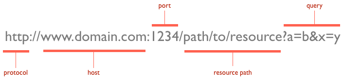

```{r setup}
#| message: False
#| warning: False
#| include: False
options(
  width=80
)

knitr::opts_chunk$set(
  fig.align = "center", fig.retina = 2, dpi = 150,
  out.width = "100%",
  message = TRUE
)

library(tidyverse)
library(rvest)
library(httr2)
```


## URLs

{fig-align="center" width="100%"}


::: {.aside}
From [HTTP: The Protocol Every Web Developer Must Know](http://code.tutsplus.com/tutorials/http-the-protocol-every-web-developer-must-know-part-1--net-31177)
:::


## Query Strings

Provides named argument(s) and value(s) that modify the behavior of the resulting page. 

<br/>

Format generally follows:

::: {.center .large}
`?arg1=value1&arg2=value2&arg3=value3`
:::

. . .

<br/>

Some quick examples,

::: {.small}
* <http://maps.googleapis.com/maps/api/geocode/json?sensor=false&address=1600+Amphitheatre+Parkway>

* <https://swapi.dev/api/people/?search=r2>
:::


## URL encoding

This will often be handled automatically by your web browser or other tool, but it is useful to know a bit about what is happening

* Spaces will be encoded as '+' or '%20'

* Certain characters are reserved and will be replaced with the percent-encoded version within a URL

::: {.small}
| !   | #   | $   | &   | '   | (   | )   |
|:---:|:---:|:---:|:---:|:---:|:---:|:---:|
| %21 | %23 | %24 | %26 | %27 | %28 | %29 |
| *   | +   | ,   | /   | :   | ;   | =   |
| %2A | %2B | %2C | %2F | %3A | %3B | %3D |
| ?   | @   | [   | ]   |
| %3F | %40 | %5B | %5D |
:::

* Characters that cannot be converted to the correct charset are replaced with HTML numeric character references (e.g. a &#931; would be encoded as &amp;#931; )

## Examples


::: {.small}
```{r}
URLencode("http://lmgtfy.com/?q=hello world")
URLdecode("http://lmgtfy.com/?q=hello%20world")
```
:::

. . .

::: {.small}
```{r}
URLencode("!#$&'()*+,/:;=?@[]")
URLencode("!#$&'()*+,/:;=?@[]", reserved = TRUE)
URLencode("!#$&'()*+,/:;=?@[]", reserved = TRUE) |> 
  URLdecode()
```
:::

. . .

::: {.small}
```{r}
URLencode("Σ")
URLdecode("%CE%A3")
```
:::


# RESTful APIs

## REST

**RE**presentational **S**tate **T**ransfer

* Describes an architectural style for web services (not a standard)

* All communication via HTTP requests and responses

* Key features:
    - **Stateless** - each request is self-contained; no session state stored on server
    - **Addressable** - resources identified by URLs (endpoints)
    - **Uniform interface** - standard HTTP methods (GET, POST, PUT, DELETE)
    - **Cacheable** - responses can be cached to improve performance

* Resources are represented in standard formats (typically JSON or XML) and delivered in the response body


## GitHub API

GitHub provides a REST API that allows you to interact with most of the data available on the website.

There is extensive documentation and a huge number of endpoints to use - almost anything that can be done on the website can also be done via the API.

<br/>

::: {.center .large}
[GitHub REST API](https://docs.github.com/en/rest)
:::


## Demo 1 - GitHub API - Basic access 

<br/><br/>

For this demo we will be using the GitHub REST API to access public data about users and repositories. 

We will be making unauthenticated requests, which are subject to stricter rate limits but do not require credentials.

::: {.center}
* [Get a user](https://docs.github.com/en/rest/users/users?apiVersion=2022-11-28#get-a-user)

* [List organization repositories](https://docs.github.com/en/rest/repos/repos?apiVersion=2022-11-28#list-organization-repositories)
:::


## Listing Repos {.scrollable}

::: {.xsmall}
```{r}
#| label: demo1-repos1
#| cache: true
z = jsonlite::read_json("https://api.github.com/orgs/sta323-sp26/repos")
length(z)
str(z, max.level = 2)
z |> map_chr("full_name")
```
:::

##

::: {.xsmall}
```{r}
#| label: demo1-repos2
#| cache: true
z = jsonlite::read_json(
  "https://api.github.com/orgs/tidyverse/repos"
)
length(z)
z |> map_chr("full_name")
```
:::


## Pagination

Many REST APIs limit the number of results returned in a single response to manage server load and improve performance. When working with large(r) datasets, you'll need to make multiple requests to retrieve all results.

Common pagination approaches:

* Offset-based - specify starting position and number of items (`?offset=20&limit=10`)

* Page-based - specify page number and page size (`?page=2&per_page=30`)

* Cursor-based - use a token/cursor pointing to next set of results

* Link header - server provides URLs to next/previous pages in response headers

::: aside
There is no single standard for pagination in (REST) APIs, so always refer to the specific API documentation for details.
:::

## GitHub API Pagination

GitHub uses page-based and link header pagination:

* Query parameters:
    - `per_page` - number of items per page (default: 30, max: 100)
    - `page` - page number to retrieve (default: 1)

* Link header: GitHub includes a `Link` header in responses with URLs for:
    - `next` - next page
    - `prev` - previous page
    - `first` - first page
    - `last` - last page

##

::: {.xsmall}
```{r}
#| label: demo1-repos3
#| cache: true
z = jsonlite::read_json(
  "https://api.github.com/orgs/tidyverse/repos?page=2"
)
length(z)
z |> map_chr("full_name")
```
:::

##

::: {.xsmall}
```{r}
#| label: demo1-repos4
#| cache: true
z = jsonlite::read_json(
  "https://api.github.com/orgs/tidyverse/repos?per_page=100"
)
length(z)
z |> map_chr("full_name")
```
:::


## Demo 2 - Authenticated Endpoint(s)

The information we've been retrieving is all public, but the GitHub API also has endpoints that require authentication (e.g. to access private user data, create repositories, etc.). This is why when requesting the `sta323-sp26` repos we get only 2 results (all of the private repos are hidden).

One example of this is the `/user` endpoint which returns information about the *authenticated* user. If we try to access this endpoint without authentication, we get an error:

::: {.small}
```{r}
#| label: demo1-auth
#| cache: true
#| error: true
jsonlite::read_json("https://api.github.com/user")
```
:::


# {.center-image}

{fig-align="center"}


## Background

`httr2` is a package designed around the construction and handling of HTTP requests and responses. It is a rewrite of the `httr` package and includes the following features:

* Pipeable API

* Explicit request object, with support for

    * rate limiting
    
    * retries
    
    * OAuth
    
    * Secure secret storage

* Explicit response object, with support for

    * error codes / reporting
    
    * common body encoding (e.g. json, etc.)


## Structure of an HTTP Request

<br/>

{fig-align="center" width="100%"}

::: {.aside}
Source - [web programming (http basics)](https://www3.ntu.edu.sg/home/ehchua/programming/webprogramming/http_basics.html)
:::

## HTTP Methods / Verbs

| Verb     | Purpose                      | GitHub API example              |
|:---------|:-----------------------------|:--------------------------------|
| `GET`    | Fetch a resource             | Get a user, list org repos      |
| `POST`   | Create a new resource        | Create a gist, open an issue    |
| `PUT`    | Full update of a resource    | Replace file contents in a repo |
| `PATCH`  | Partial update of a resource | Update a repo's description     |
| `DELETE` | Remove a resource            | Delete a gist                   |

<br/>

`GET` and `POST` are by far the most common when consuming APIs.

Less common verbs: `HEAD`, `TRACE`, `OPTIONS`.


## httr2 request objects

A new request object is constructed via `request()` which is then modified via `req_*()` functions

Some useful functions:

* `request()` - initialize a request object

* `req_method()` - set HTTP method

* `req_url_query()` - add query parameters to URL

* `req_body_json()`, `req_body_raw()`, etc. - set body content (various formats and sources)

* `req_user_agent()` - set request user-agent header

* `req_dry_run()` - shows the exact request that will be made

## Example

::: {.small}
```{r}
req = request("https://api.github.com/orgs/tidyverse/repos") |>
  req_url_query(per_page=100) |>
  req_user_agent("Sta323 Demo Client/0.1")
```
```{r}
req
req |> req_dry_run()
```
:::


## Structure of an HTTP Response

<br/>

{fig-align="center" width="100%"}

::: {.aside}
Source - [web programming (http basics)](https://www3.ntu.edu.sg/home/ehchua/programming/webprogramming/http_basics.html)
:::

## Status Codes

In general,

::: {.columns}
::: {.column}
* `2XX` - Success
* `3XX` - Redirection
:::
::: {.column}
* `4XX` - Client error
* `5XX` - Server error
:::
:::

. . .

Some specific examples:

::: {.small}
| Code | Description              | Meaning |
|:----:|:-------------------------|:------------------------------------------------|
| 200  | OK                       | Request succeeded |
| 201  | Created                  | Resource created (POST/PUT success) |
| 204  | No Content               | Success with no response body |
| 301  | Moved Permanently        | Permanent redirect |
| 400  | Bad Request              | Malformed request syntax or parameters |
| 401  | Unauthorized             | Authentication required or failed |
| 403  | Forbidden                | Authenticated but not permitted |
| 404  | Not Found                | Resource doesn't exist |
| 429  | Too Many Requests        | Rate limit exceeded |
| 500  | Internal Server Error    | Server-side failure |
| 503  | Service Unavailable      | Server temporarily unavailable |
:::


## httr2 response objects

Once a request is made via `req_perform()`, a response object will be returned (the most recent response can also be retrieved via `last_response()`). Contents of the response are accessed via the `resp_*()` functions

Some useful functions:

* `resp_status()` - extract HTTP status code 

* `resp_status_desc()` - text description of the status code

* `resp_content_type()` - extract content type and encoding

* `resp_body_json()`, `resp_body_html()`, etc. - extract body using specified format

* `resp_headers()` - extract response headers

# Demo 3 - httr2 + GitHub

## Basic Request {.scrollable}

::: {.small}
```{r}
#| label: demo2-basic
#| cache: true
resp = request("https://api.github.com/users/rundel") |>
  req_perform()
```
```{r}
#| label: demo2-basic2
#| cache: true
resp |> resp_status()
resp |> resp_status_desc()
resp |> resp_content_type()
```
:::

. . .

::: {.small}
```{r}
#| label: demo2-basic3
#| cache: true
resp |> resp_body_json() |> str()
```
:::

## Pagination w/ httr2

::: {.small}
```{r}
#| cache: true
request("https://api.github.com/orgs/tidyverse/repos") |>
  req_auth_bearer_token(gitcreds::gitcreds_get()$password) |>
  req_perform() |>
  resp_body_json() |>
  map_chr("full_name")
```
:::

##

```{r}
#| include: false
options(width=60)
```

::: {.columns .small}
::: {.column}
```{r}
#| cache: true
request("https://api.github.com/orgs/tidyverse/repos") |>
  req_url_query(page=2) |>
  req_perform() |>
  resp_body_json() |>
  map_chr("full_name")
```
:::
::: {.column}
```{r}
#| cache: true
request("https://api.github.com/orgs/tidyverse/repos") |>
  req_url_query(per_page=100) |>
  req_perform() |>
  resp_body_json() |>
  map_chr("full_name")
```
:::
:::

```{r}
#| include: false
options(width=80)
```

## `req_perform_iterative()`

Pagination bookkeeping is annoying - this can (sometimes) be handled automatically with `req_perform_iterative()` - see `?iterate_with_offset` for pre-built helpers.

::: {.xsmall}
```{r}
#| cache: true
resps = request("https://api.github.com/orgs/tidyverse/repos") |>
  req_url_query(per_page=15) |>
  req_perform_iterative(next_req = iterate_with_link_url())

resps
```
:::

##

::: {.small}
```{r}
#| cache: true
resps |>
  map(resp_body_json) |>
  purrr::list_flatten() |>
  map_chr("full_name")
```
:::


## Error Handling in httr2

By default, `httr2` throws an R error for HTTP error responses (4xx and 5xx):

::: {.xsmall}
```{r}
#| cache: true
#| error: true
request("https://api.github.com/user") |>
  req_perform()
```
:::

. . .

::: {.xsmall}
```{r}
#| label: error-handling
#| cache: true
resp = request("https://api.github.com/user") |>
  req_error(is_error = function(resp) FALSE) |>
  req_perform() 
```
```{r}
#| label: error-handling2
#| cache: true
resp |> resp_status()
resp |> resp_status_desc()
resp |> resp_body_json() |> str()
```
:::


## Authentication

Most APIs have rate limits and access restrictions:

* Unauthenticated requests - limited rate limits, restricted access
* Authenticated requests - higher rate limits, access to private resources

GitHub API rate limits (per hour):

* Unauthenticated: 60 requests
* Authenticated: 5,000 requests (personal access token)

Authentication is done via HTTP headers, typically:

* `Authorization: Bearer <token>`

::: aside
Here `Authorization` is the request header and `Bearer <token>` is the value. With `httr2` `req_auth_bearer_token()` can be used to add this header.
:::


## GitHub Personal Access Tokens (PATs)

::: {.medium}
A PAT is a secure alternative to using passwords for API authentication:

* Generated on GitHub: Settings → Developer settings → Personal access tokens
* Choose scopes (permissions) carefully - only grant what's needed
* Two types:
    - Fine-grained tokens - repository-specific access (recommended)
    - Classic tokens - broader access patterns

Best practices:

* Never commit tokens to git repositories
* Store in environment variables (e.g., `.Renviron`)
* Use packages like `gitcreds` or `credentials` to manage tokens securely
* Set expiration dates and rotate tokens regularly
:::
. . .

::: {.medium}
For all of the following examples, I have created a PAT and added via `gitcreds::gitcreds_set()` to store it securely.
:::

## Demo 4 - Using Authentication

::: {.xsmall}
```{r}
#| cache: true
request("https://api.github.com/user") |>
  req_auth_bearer_token(gitcreds::gitcreds_get()$password) |>
  req_perform() |>
  resp_body_json() |>
  str()
``` 
:::

##

::: {.xsmall}
```{r}
#| cache: true
request("https://api.github.com/user") |>
  req_headers(
    Authorization = paste("Bearer", gitcreds::gitcreds_get()$password)
  ) |>
  req_perform() |>
  resp_body_json() |> 
  str()
```
:::


## Demo 5 - POST Request

::: {.xsmall}
```{r}
gist = request("https://api.github.com/gists") |>
  req_auth_bearer_token(gitcreds::gitcreds_get()$password) |>
  req_body_json(list(
    description = "Testing 1 2 3 ...",
    files = list("test.R" = list(content = "print('hello world')\n")),
    public = TRUE
  ))

gist |> req_dry_run()
```
:::

##

::: {.small}
```{r}
#| cache: true
resp = gist |> req_perform()
resp |> resp_status()
resp |> resp_status_desc()
resp |> resp_body_json() |> pluck("html_url")
```
:::


# Other Useful httr2 Features


## Rate Limiting - `req_throttle()`

APIs enforce rate limits — exceeding them results in `429 Too Many Requests` or similar errors. `req_throttle()` automatically inserts delays between requests to stay within a limit:

::: {.small}
```{r}
#| eval: false
# At most 30 requests per minute
req = request("https://api.github.com") |>
  req_throttle(rate = 30 / 60)

# Each req_perform() call on this request will wait if needed
req |> req_url_path("/users/rundel") |> req_perform()
req |> req_url_path("/users/hadley")  |> req_perform()
```
:::

. . .

The `rate` argument is **requests per second**. The throttle is applied per-hostname, so all requests to the same host share the same token bucket.

::: {.aside}
GitHub's unauthenticated limit is 60/hour ≈ `rate = 60/3600`; authenticated is 5,000/hour ≈ `rate = 5000/3600`.
:::


## Automatic Retries - `req_retry()`

Transient failures (network blips, `429`, `503`) can be retried automatically with `req_retry()`:

::: {.small}
```{r}
#| eval: false
request("https://api.github.com/users/rundel") |>
  req_retry(
    max_tries = 5,
    is_transient = function(resp) {resp_status(resp) %in% c(429, 500, 503)}
  ) |>
  req_perform()
```
:::

. . .

Key arguments:

* `max_tries` - maximum total attempts (including the first)
* `max_seconds` - give up after this many seconds total
* `is_transient` - function deciding if a response warrants a retry
* `backoff` - function computing wait time between attempts (default: exponential backoff)


## Response Caching - `req_cache()`

`req_cache()` stores responses on disk and replays them for identical requests, respecting HTTP cache headers:

::: {.small}
```{r}
#| eval: false
request("https://api.github.com/users/rundel") |>
  req_cache(path = "api_cache/") |>
  req_perform()
```
:::

. . .

* The cache is keyed on the full request URL and headers
* Cached responses are reused until they expire (based on `Cache-Control` / `Expires` headers)
* Pass `max_age` to set a maximum cache age regardless of server headers:


