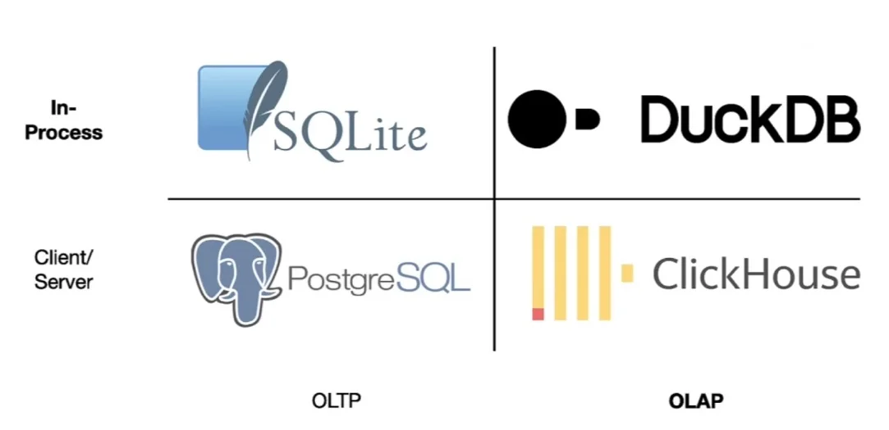

```{r setup}
#| message: False
#| warning: False
#| include: False
options(
  width=70
)

knitr::opts_chunk$set(
  fig.align = "center", fig.retina = 2, dpi = 150,
  out.width = "100%", warning = TRUE
  #comment = "##"
)

library(dplyr)
library(duckknit)
```


## SQL

```{css}
/*| echo: false
code.sql > span > a::after {
  content: "D ";
  color: #aaaaaa;
}

pre.shell > code > span > a::after {
  content: "> ";
  color: #aaaaaa;
}
```

```{css}
/*| echo: false
.reveal pre code {
  text-wrap-mode: nowrap !important;
  max-height: 520px !important;
}
```

Structured Query Language is a special purpose language for interacting with (querying and modifying) indexed tabular data.

* ANSI Standard but with dialect divergence (MySql, Postgres, SQLite, etc.)

* This functionality maps very closely (but not exactly) with the data manipulation verbs present in dplyr.

* SQL is likely to be a foundational skill if you go into industry - learn it and put it on your CV


## DuckDB

> DuckDB is an open-source column-oriented relational database management system (RDBMS) originally developed by Mark Raasveldt and Hannes Mühleisen at the Centrum Wiskunde & Informatica (CWI) in the Netherlands and first released in 2019. The project has over 6 million downloads per month. It is designed to provide high performance on complex queries against large databases in embedded configuration, such as combining tables with hundreds of columns and billions of rows. Unlike other embedded databases (for example, SQLite) DuckDB is not focusing on transactional (OLTP) applications and instead is specialized for **online analytical processing (OLAP)** workloads.

From [Wikipedia - DuckDB](https://en.wikipedia.org/wiki/DuckDB)

## OLTP vs OLAP / In-Process vs Server

::: {.center}

:::

::: {.aside}
From InfoQ - [In-Process Analytical Data Management with DuckDB](https://www.infoq.com/articles/analytical-data-management-duckdb/)
:::

## DuckDB & DBI

DuckDB is a relational database just like SQLite and can be interacted with using DBI and the duckdb package.

::: {.small}
```{r}
library(DBI)
(con = dbConnect(duckdb::duckdb()))
```
:::

. . .

::: {.small}
```{r}
dbWriteTable(con, "flights", nycflights13::flights)
dbListTables(con)
```
:::

##

::: {.small}
```{r}
dbGetQuery(con, "SELECT * FROM flights") |>
  as_tibble()
```
:::

##

::: {.small}
```{r}
#| message: false
library(dplyr)
tbl(con, "flights") |>
  filter(month == 10, day == 29) |>
  count(origin, dest) |>
  arrange(desc(n))
```
:::

# DuckDB CLI

```{r}
#| include: false
db = DBI::dbConnect(duckdb::duckdb(), "Lec21/employees.duckdb")
DBI::dbExecute(db, "DROP TABLE IF EXISTS phone")
DBI::dbExecute(db, "DROP VIEW IF EXISTS phone_view")
DBI::dbDisconnect(db)
```

## Connecting via CLI

::: {.small}
```shell
duckdb employees.duckdb
```
```
DuckDB v1.5.1 (Variegata)
Enter ".help" for usage hints.
employees D 
```
:::

. . .

<br/>

Once connected, you can run SQL queries directly in the terminal. For example,


::: {.small}
```{duckdb, db='Lec21/employees.duckdb', session='employees'}
SELECT 'Hello, DuckDB!' AS greeting;
```
:::


## Table information

Dot commands are expressions that begins with `.` and are specific to the DuckDB CLI, some examples include:

::: {.columns .xsmall}
::: {.column width="40%"}
```{duckdb}
.tables
```
:::
::: {.column .fragment width="60%"}
```{duckdb}
.schema employees
```
```{duckdb}
.version
```
```{duckdb}
.print TESTING 1 2 3 ...
```
:::
:::

. . .

<br/>

A full list of available dot commands can be found [here](https://duckdb.org/docs/stable/clients/cli/dot_commands.html) or listed via `.help` in the CLI.


## Basic SQL query

::: {.small}
```{duckdb}
SELECT * FROM employees;
```
:::


## Output formats

The format of duckdb's output (in the CLI) is controlled via `.mode` -  the default is `duckbox`, see possible [output formats](https://duckdb.org/docs/stable/clients/cli/output_formats.html). 

:::: {.columns .mxsmall}
::: {.column width='50%'}
```{duckdb}
.mode csv
SELECT * FROM employees;
```
:::

::: {.column width='50%'}

```{duckdb}
.mode markdown
SELECT * FROM employees;
```
:::
::::

:::: {.columns .mxsmall}
::: {.column width='50%'}
```{duckdb}
.mode json
SELECT * FROM employees;
```
:::

::: {.column width='50%'}
```{duckdb}
.mode insert
SELECT * FROM employees;
```
:::
::::

```{duckdb, echo=FALSE}
.mode duckbox
```


# A brief tour of SQL


## Basic Keywords

We can subset and rename columns, sort results, and limit output using `SELECT`, `ORDER BY`, and `LIMIT`. Additionally, `DISTINCT` can be used to remove duplicate values.

::: {.columns .small}
::: {.column}
```{duckdb}
SELECT name AS first_name, salary
FROM employees
ORDER BY salary DESC
LIMIT 3;
```
:::
::: {.column .fragment}
```{duckdb}
SELECT DISTINCT dept
FROM employees;
```
:::
:::

::: {.aside}
SQL clauses are evaluated in a different order than they are written: `FROM` → `WHERE` → `GROUP BY` → `SELECT` → `ORDER BY` → `LIMIT`
:::


## filter() using WHERE

We can filter rows using a `WHERE` clause

::: {.small}
```{duckdb}
SELECT * FROM employees WHERE salary < 40000;
```

```{duckdb}
SELECT * FROM employees WHERE salary < 40000 AND dept = 'Sales';
```
:::

## GROUP BY and HAVING

`GROUP BY` groups rows for aggregation; `HAVING` filters *after* aggregation (like `WHERE` but for grouped results).

::: {.xsmall}
```{duckdb}
SELECT dept, COUNT(*) AS n, ROUND(AVG(salary),2) AS avg_salary
FROM employees GROUP BY dept;
```
:::

. . .

::: {.xsmall}
```{duckdb}
SELECT dept, COUNT(*) AS n, ROUND(AVG(salary),2) AS avg_salary
FROM employees GROUP BY dept
HAVING avg_salary > 38000;
```
:::


## Exercise 1

Using DuckDB calculate the following quantities for `employees.duckdb`,

1. The total costs in payroll for this company

2. The number of employees in each department who earn more than $35,000

::: {.aside}
[DuckDB's aggregation functions](https://duckdb.org/docs/stable/sql/functions/aggregates.html)
:::


## Reading from CSV files

DuckDB has a neat trick in that it can treat files as tables (for supported formats), this lets you query them without having to explicitly create a table in the database.

We can also make this explicit by using the `read_csv()` function, which is useful if we need to use custom options (e.g. specify a different delimiter)

:::: {.columns .xsmall}
::: {.column width='50%'}
```{duckdb}
SELECT * FROM 'Lec21/phone.csv';
```
:::

::: {.column width='50%'}
```{duckdb}
SELECT * FROM
  read_csv('Lec21/phone.csv', delim = ',');
```
:::
::::

## Tables from CSV

If we wanted to explicitly create a table from the CSV file this is also possible, 

::: {.columns .mxsmall}
::: {.column}
```{duckdb}
.tables
```

:::
::: {.column}
```{duckdb}
CREATE TABLE phone AS
  SELECT * FROM 'Lec21/phone.csv';
.tables
```
:::
:::

. . .

::: {.mxsmall}
```{duckdb}
SELECT * FROM phone;
```
:::

## Views from CSV

It is also possible to create a view from a file - this acts like a table but the data is not copied from the file. This means the file must remain accessible and is re-read on every query, but no storage is used within the database.

::: {.columns .mxsmall}
::: {.column}
```{duckdb}
CREATE VIEW phone_view AS
  SELECT * FROM 'Lec21/phone.csv';
```
```{duckdb}
.tables
```
:::
::: {.column}
```{duckdb}
SELECT * FROM phone_view;
```
:::
:::


## Deleting tables and views

Tables and views can be deleted using `DROP`

::: {.columns .mxsmall}
::: {.column}
```{duckdb}
.tables
```
:::
::: {.column}
```{duckdb}
DROP TABLE phone;
DROP VIEW phone_view;
```
:::
:::

. . .

::: {.mxsmall}

```{duckdb}
.tables
```
:::


```{duckdb, echo=FALSE}
CREATE OR REPLACE TABLE phone AS SELECT * FROM 'Lec21/phone.csv';
```

## Inner Join

DuckDB requires an `ON` or `USING` clause for joins - `JOIN` alone is a syntax error.

::: {.small}
```{duckdb}
SELECT * FROM employees JOIN phone USING(name);
```
:::

::: {.aside}
`USING(col)` joins on a named column (no duplicate column in result); `ON t1.colA = t2.colB` is needed when column names differ. `NATURAL JOIN` automatically matches all common column names - convenient but can produce unexpected results when tables share more columns than intended.
:::

## Other Joins

::: {.medium}
All standard joins are supported: `LEFT JOIN`, `RIGHT JOIN`, `FULL JOIN`, `CROSS JOIN`, `SEMI JOIN`, `ANTI JOIN`, etc.
:::

::: {.mxsmall}
```{duckdb}
SELECT * FROM employees LEFT JOIN phone USING(name);
```
```{duckdb}
SELECT * FROM employees FULL JOIN phone USING(name);
```
:::

##

::: {.xsmall}
```{duckdb}
SELECT * FROM employees RIGHT JOIN phone USING(name);
```
```{duckdb}
SELECT * FROM employees ANTI JOIN phone USING(name);
```
:::

## Subqueries

Tables can be nested within tables for the purpose of creating more complex queries,

::: {.mxsmall}
```{duckdb}
SELECT * FROM (
  SELECT * FROM employees NATURAL LEFT JOIN phone
) combined WHERE phone IS NULL;
```

```{duckdb}
SELECT * FROM (
  SELECT * FROM employees NATURAL LEFT JOIN phone
) combined WHERE phone IS NOT NULL;
```
:::


## Common Table Expressions

A CTE (defined with `WITH`) is a named subquery that can be referenced by name in the main query - useful for breaking complex queries into readable steps, or reusing a subquery multiple times.

::: {.xsmall}
```{duckdb}
WITH combined AS (
  SELECT * FROM employees NATURAL LEFT JOIN phone
)
SELECT * FROM combined WHERE phone IS NULL;
```
:::

::: {.aside}
Multiple CTEs can be chained with commas: `WITH cte1 AS (...), cte2 AS (...) SELECT ...`
:::


## Exercise 2

1. What percentage of the total payroll does each department account for?

2. How much more (or less) than their department's average salary does each employee earn?

<!--
## Part 1 - subquery version
```sql
SELECT dept, round(sum(salary) / (SELECT sum(salary) FROM employees) * 100, 2) AS pct_payroll
FROM employees
GROUP BY dept;
```

## Part 1 - CTE version
```sql
WITH total AS (
  SELECT sum(salary) AS total_salary FROM employees
)
SELECT dept, round(sum(salary) / total_salary * 100, 2) AS pct_payroll
FROM employees CROSS JOIN total
GROUP BY dept, total_salary;
```

## Part 2 - subquery version
```sql
SELECT *, round(salary-avg,2) AS abv_avg
FROM employees
NATURAL JOIN  (
  SELECT dept, round(avg(salary),2) AS avg FROM employees GROUP BY dept
) dept_avg
ORDER BY dept, abv_avg;
## ┌─────────┬───────────────────┬─────────┬────────────┬──────────┬─────────┐
## │  name   │       email       │ salary  │    dept    │   avg    │ abv_avg │
## │ varchar │      varchar      │ double  │  varchar   │  double  │ double  │
## ├─────────┼───────────────────┼─────────┼────────────┼──────────┼─────────┤
## │ Alice   │ alice@company.com │ 52000.0 │ Accounting │ 41666.67 │ 10333.0 │
## │ Bob     │ bob@company.com   │ 40000.0 │ Accounting │ 41666.67 │ -1667.0 │
## │ Carol   │ carol@company.com │ 30000.0 │ Sales      │  37000.0 │ -7000.0 │
## │ Dave    │ dave@company.com  │ 33000.0 │ Accounting │ 41666.67 │ -8667.0 │
## │ Eve     │ eve@company.com   │ 44000.0 │ Sales      │  37000.0 │  7000.0 │
## │ Frank   │ frank@company.com │ 37000.0 │ Sales      │  37000.0 │     0.0 │
## └─────────┴───────────────────┴─────────┴────────────┴──────────┴─────────┘
```

## Part 2 - CTE version
```sql
WITH dept_avg AS (
  SELECT dept, round(avg(salary),2) AS avg FROM employees GROUP BY dept
)
SELECT *, round(salary-avg,2) AS abv_avg
FROM employees
NATURAL JOIN dept_avg
ORDER BY dept, abv_avg;
```
-->


```{duckdb, db='Lec21/employees.duckdb', session='employees', echo=FALSE}
DROP TABLE IF EXISTS phone;
DROP VIEW IF EXISTS phone_view;
```

# Query plan

## Setup

To give us a bit more variety (and data), we have created another DuckDB database `flights.duckdb` that contains both `nycflights13::flights` and `nycflights13::planes`, the latter of which has details on each plane identified by tail number.


To create the database you can run,

::: {.small}
```{r}
#| eval: False
db = DBI::dbConnect(duckdb::duckdb(), "flights.duckdb")
dplyr::copy_to(db, nycflights13::flights, name = "flights", temporary = FALSE, overwrite = TRUE)
dplyr::copy_to(db, nycflights13::planes, name = "planes", temporary = FALSE, overwrite = TRUE)
DBI::dbDisconnect(db)
```
:::

Alternative you can use the copy provided in the `exercises` repo.


## Opening `flights.duckdb`

The database can then be opened from the terminal tab using,
```shell
duckdb flights.duckdb
```

Before we start we will set a couple of configuration options so that our output is readable. 

We also include `.timer on` so that we get timings for our queries.

::: {.small}
```{duckdb, db='Lec21/flights.duckdb', session='flights'}
.maxrows 20
.maxwidth 80
.timer on
```
:::

## `flights`

::: {.small}
```{duckdb}
SELECT * FROM flights LIMIT 10;
```
:::

## `planes`

::: {.small}
```{duckdb}
SELECT * FROM planes LIMIT 10;
```
:::


## tables

::: {.mxsmall}
```{duckdb}
.tables
```
:::

## Exercise 3

What is the total number of seats available on all of the planes that flew out of New York in 2013.


## A Solution?

Does the following seem correct?

::: {.small}
```{duckdb}
SELECT sum(seats) FROM flights NATURAL LEFT JOIN planes;
```
:::


<br/><br/>

::: {.center .large}
Why or why not? 
:::


## Correct solution

**Join and select**:

::: {.small}
```{duckdb}
SELECT sum(seats) FROM flights LEFT JOIN planes USING (tailnum);
```
:::


## `EXPLAIN`

::: {.mxsmall}
```{duckdb}
EXPLAIN SELECT sum(seats) FROM flights LEFT JOIN planes USING (tailnum);
```
:::

## `EXPLAIN` - key operators

::: {.medium}
| Operator | Description |
|---|---------|
| `SEQ_SCAN` | Read every row of a table sequentially |
| `FILTER` | Apply a `WHERE` condition to rows |
| `PROJECTION` | Compute and select output columns (`SELECT`) |
| `HASH_JOIN` | Join two tables by building a hash table on the smaller one |
| `HASH_GROUP_BY` | Group rows and compute aggregates using a hash table (`GROUP BY`) |
| `UNGROUPED_AGGREGATE` | Compute a single aggregate over all rows (no `GROUP BY`) |
| `CROSS_PRODUCT` | Cartesian product of two inputs (`CROSS JOIN`) |
| `ORDER_BY` | Sort rows (`ORDER BY`) |
| `TOP_N` | Efficiently returns the top N sorted rows (`ORDER BY` + `LIMIT`) |
:::

## `EXPLAIN ANALYZE`

::: {.mxsmall}
```{duckdb}
EXPLAIN ANALYZE SELECT sum(seats) FROM flights LEFT JOIN planes USING (tailnum);
```
:::

## dplyr

::: {.small}
```{r}
library(dplyr)
flights = nycflights13::flights
planes = nycflights13::planes

system.time({
  flights |>
    left_join(planes, by = c("tailnum" = "tailnum")) |>
    summarise(total_seats = sum(seats, na.rm = TRUE))
})
```
:::


## A more complex query

For each carrier and departure airport, how much better or worse (as a %) is their average departure delay compared to the overall average?

. . .

::: {.mxsmall}
```{duckdb}
#| output-location: column
WITH overall AS (
  SELECT AVG(dep_delay) AS avg_delay FROM flights
)
SELECT carrier,
       ROUND(AVG(dep_delay), 2) AS carrier_avg_delay,
       ROUND((AVG(dep_delay) - avg_delay) 
             / avg_delay, 3) 
       AS pct_vs_overall
FROM flights CROSS JOIN overall
GROUP BY carrier, avg_delay
ORDER BY pct_vs_overall;
```
:::

## `EXPLAIN ANALYZE`

::: {.xxsmall}
```{duckdb}
#| output-location: column
EXPLAIN ANALYZE
WITH overall AS (
  SELECT AVG(dep_delay) AS avg_delay FROM flights
)
SELECT carrier,
       ROUND(AVG(dep_delay), 2) AS carrier_avg_delay,
       ROUND((AVG(dep_delay) - avg_delay) 
             / avg_delay, 3) 
       AS pct_vs_overall
FROM flights CROSS JOIN overall
GROUP BY carrier, avg_delay
ORDER BY pct_vs_overall;
```
:::

## dplyr

::: {.small}
```{r}
system.time({
  overall_avg = nycflights13::flights |>
    summarise(avg_delay = mean(dep_delay, na.rm = TRUE)) |>
    pull(avg_delay)

  nycflights13::flights |>
    group_by(carrier) |>
    summarise(carrier_avg_delay = round(mean(dep_delay, na.rm = TRUE), 2), .groups = "drop") |>
    mutate(pct_vs_overall = round((carrier_avg_delay - overall_avg) / overall_avg, 3)) |>
    arrange(pct_vs_overall)
})
```
:::


# NYC Taxi Demo

## NYC Taxi Data

The [NYC TLC Trip Record Data](https://www.nyc.gov/site/tlc/about/tlc-trip-record-data.page) is a large public dataset of taxi and for-hire vehicle trips in New York City, published monthly since 2009.

Each row is one trip and includes:

::: {.medium}
| Column | Description |
|---|-----|
| `tpep_pickup_datetime` / `tpep_dropoff_datetime` | Trip start and end times |
| `trip_distance` | Distance traveled (miles) |
| `PULocationID` / `DOLocationID` | Pickup and dropoff taxi zone |
| `fare_amount`, `tip_amount`, `total_amount` | Fare components |
| `payment_type` | How the fare was paid (card, cash, etc.) |
| `passenger_count` | Number of passengers |
:::

Recent years are distributed as parquet files (one per month), with each file containing millions of rows.

## Taxi data

::: {.xsmall}
```{r}
(d = fs::dir_info("~/Scratch/nyctaxi/") |>
  dplyr::transmute(path = fs::path_file(path), size))
sum(d$size)
```
:::

::: {.aside}
If you want to try this out the files are available on the departmental servers in `/data/nyctaxi/`.
:::

## Parquet

Parquet is a binary, columnar file format widely used in data science and analytics.

:::: {.columns}
::: {.column width='50%'}
**Row-oriented (CSV)**

```
name,  salary, dept
Alice, 52000,  Accounting
Bob,   40000,  Accounting
Carol, 30000,  Sales
```
Reading one column requires reading every row.
:::

::: {.column width='50%'}
**Column-oriented (Parquet)**

```
name:   [Alice, Bob, Carol, ...]
salary: [52000, 40000, 30000, ...]
dept:   [Accounting, Accounting, Sales, ...]
```
Reading one column skips all others entirely.
:::
::::

Key advantages over CSV: *compressed* (much smaller files), *typed* (no schema inference), *fast for analytical queries* (only reads needed columns). Widely used with Spark, Arrow, Pandas, and cloud data warehouses.


## Reading from Parquet files

DuckDB can query Parquet files directly - no explicit import step needed.

:::: {.columns .xxsmall}
::: {.column width='50%'}
```sql
SELECT * FROM 
  '~/Scratch/nyctaxi/yellow_tripdata_2024-01.parquet' 
  LIMIT 5;
```
:::
::: {.column width='50%'}
```sql
SELECT * FROM 
  '~/Scratch/nyctaxi/yellow_tripdata_*.parquet' 
  LIMIT 5;
```
:::
::::

Glob patterns let you query multiple files as a single table - useful for partitioned datasets.

. . .

The same `CREATE TABLE` / `CREATE VIEW` pattern from CSV works with Parquet:

::: {.xsmall}
```sql
CREATE VIEW taxi AS SELECT * FROM 
  read_parquet('~/Scratch/nyctaxi/yellow_tripdata_*.parquet');
```
:::

::: {.aside}
DuckDB can also read remote Parquet files directly via HTTPS, enabling queries over S3 or other cloud storage without downloading the file first.
:::


## Setup

Enable timings and create a view over all monthly Parquet files:

::: {.xsmall}
```{duckdb, session="taxi"}
.timer on
CREATE VIEW taxi AS SELECT * FROM 
  read_parquet('~/Scratch/nyctaxi/yellow_*.parquet');
```
:::

. . .

<br/>

How many rows?

::: {.small}
```{duckdb}
SELECT count(*) FROM taxi;
```
:::


## Schema

::: {.columns .xsmall}
::: {.column}
```{duckdb}
DESCRIBE SELECT * FROM taxi;
```
:::
::: {.column}
```{duckdb}
.tables
```
:::
:::


## Payment types

Create a lookup table for the numeric `payment_type` codes:

::: {.xsmall}
```{duckdb}
#| output-location: column
CREATE TABLE payment_types AS
SELECT * FROM (
  VALUES
    (0, 'Flex Fare trip'),
    (1, 'Credit card'),
    (2, 'Cash'),
    (3, 'No charge'),
    (4, 'Dispute'),
    (5, 'Unknown'),
    (6, 'Voided trip')
) AS t(payment_type, payment_type_desc);

SELECT * FROM payment_types;
```
:::


## Tip percentage

What fraction of the fare is tipped on average, by payment type?

::: {.xsmall}
```{duckdb}
SELECT payment_type_desc,
       round(avg(tip_amount / fare_amount), 4) AS mean_tip_frac,
       count(*) AS n
FROM taxi
JOIN payment_types USING (payment_type)
WHERE tip_amount >= 0 AND fare_amount > 0
GROUP BY payment_type, payment_type_desc
ORDER BY payment_type;
```
:::


## Cost per mile {.scrollable}

Average fare per mile for each pickup zone, joined with zone names:

::: {.mxsmall}
```{duckdb}
SELECT * FROM (
  SELECT
    PULocationID AS pickup_zone,
    ROUND(AVG(fare_amount), 2) AS fare_amount,
    ROUND(AVG(trip_distance), 2) AS trip_distance,
    ROUND(AVG(fare_amount / trip_distance), 2) AS fare_per_mile,
    COUNT(*) AS num_rides
  FROM taxi
  WHERE trip_distance > 0 AND fare_amount > 0
  GROUP BY PULocationID
) NATURAL LEFT JOIN (
  SELECT LocationID AS pickup_zone, *
  FROM read_csv('~/Scratch/nyctaxi/taxi_zone_lookup.csv')
)
ORDER BY fare_per_mile DESC;
```
:::


## Cost per mile - median {.scrollable}

Using `quantile_cont` instead of `AVG` for a more robust estimate:

::: {.mxsmall}
```{duckdb}
#| code-line-numbers: "|4,5,6"
SELECT * FROM (
  SELECT
    PULocationID AS pickup_zone,
    ROUND(quantile_cont(fare_amount, 0.5), 2) AS fare_amount,
    ROUND(quantile_cont(trip_distance, 0.5), 2) AS trip_distance,
    ROUND(quantile_cont(fare_amount / trip_distance, 0.5), 2) AS fare_per_mile,
    COUNT(*) AS num_rides
  FROM taxi
  WHERE trip_distance > 0 AND fare_amount > 0
  GROUP BY PULocationID
) NATURAL LEFT JOIN (
  SELECT LocationID AS pickup_zone, *
  FROM read_csv('~/Scratch/nyctaxi/taxi_zone_lookup.csv')
)
ORDER BY fare_per_mile DESC;
```
:::