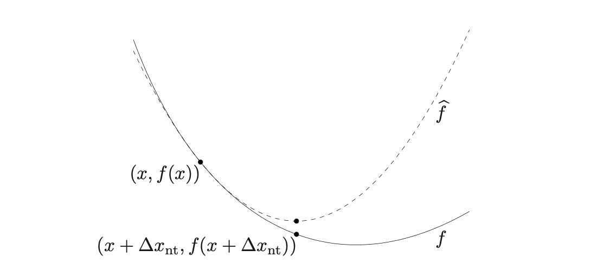

```{r setup}
#| message: false
#| warning: false
#| include: false

knitr::opts_chunk$set(
  fig.align = "center", fig.retina = 2, dpi = 150,
  out.width = "100%"
)

library(bench)
library(tidyverse)
ggplot2::theme_set(ggplot2::theme_bw())

options(width = 70)
```


```{r helpers}
#| include: false

plot_1d_traj = function(xlim, f, traj, title = "") {
  x_range = xlim[2] - xlim[1]
  x_focus = seq(xlim[1], xlim[2], length.out = 201)
  x_ext = seq(xlim[1] - 0.2 * x_range, xlim[2] + 0.2 * x_range, length.out = 281)

  traj_x = unlist(traj$x)
  traj_f = unlist(traj$f)

  df_curve = tibble(x = x_ext, y = f(x_ext))
  df_traj = tibble(x = traj_x, y = traj_f)

  y_focus = f(x_focus)

  ggplot() +
    geom_line(data = df_curve, aes(x, y)) +
    geom_path(data = df_traj, aes(x, y), color = "blue") +
    geom_point(data = df_traj, aes(x, y), color = "blue", size = 2) +
    geom_point(data = df_traj[1, ], aes(x, y), color = "red", size = 3) +
    geom_point(data = df_traj[nrow(df_traj), ], aes(x, y), color = "cyan3", size = 3) +
    coord_cartesian(xlim = xlim, ylim = range(y_focus)) +
    labs(title = title, x = "x", y = "f(x)")
}

plot_2d_traj = function(xlim, ylim, f, traj = NULL, title = "") {
  grid = expand.grid(
    x = seq(xlim[1], xlim[2], length.out = 100),
    y = seq(ylim[1], ylim[2], length.out = 100)
  )
  grid$z = apply(grid, 1, f)
  grid$log_z = log(grid$z + 0.01)

  p = ggplot(grid, aes(x, y)) +
    geom_raster(aes(fill = log_z)) +
    geom_contour(aes(z = log_z), color = "grey30", linewidth = 0.3) +
    scale_fill_distiller(palette = "Greys", direction = 1) +
    coord_cartesian(xlim = xlim, ylim = ylim) +
    labs(title = title, x = "x", y = "y") +
    guides(fill = "none")

  if (!is.null(traj)) {
    df_traj = tibble(
      x = sapply(traj$x, `[`, 1),
      y = sapply(traj$x, `[`, 2)
    )
    p = p +
      geom_path(data = df_traj, aes(x, y), color = "blue") +
      geom_point(data = df_traj, aes(x, y), color = "blue", size = 1.5) +
      geom_point(data = df_traj[1, ], aes(x, y), color = "red", size = 3) +
      geom_point(data = df_traj[nrow(df_traj), ], aes(x, y), color = "cyan3", size = 3)
  }

  p
}

mk_quad = function(epsilon, ndim = 2) {
  scaling = epsilon^(0:(ndim - 1))

  list(
    f = function(x) {
      0.33 * sum((x * scaling)^2)
    },
    grad = function(x) {
      0.66 * scaling^2 * x
    },
    hess = function(x) {
      diag(0.66 * scaling^2)
    }
  )
}

mk_rosenbrock = function() {
  list(
    f = function(x) {
      y = 4 * x
      y[1] = y[1] + 1
      y[-1] = y[-1] + 3
      sum(0.5 * (1 - y[-length(y)])^2 + (y[-1] - y[-length(y)]^2)^2)
    },
    grad = function(x) {
      y = 4 * x
      y[1] = y[1] + 1
      y[-1] = y[-1] + 3
      n = length(y)
      der = numeric(n)
      if (n > 2) {
        xm = y[2:(n-1)]
        xm_m1 = y[1:(n-2)]
        xm_p1 = y[3:n]
        der[2:(n-1)] = 2 * (xm - xm_m1^2) - 4 * (xm_p1 - xm^2) * xm - 0.5 * 2 * (1 - xm)
      }
      der[1] = -4 * y[1] * (y[2] - y[1]^2) - 0.5 * 2 * (1 - y[1])
      der[n] = 2 * (y[n] - y[n-1]^2)
      4 * der
    },
    hess = function(x) {
      y = 4 * x
      y[1] = y[1] + 1
      y[-1] = y[-1] + 3
      n = length(y)

      H = matrix(0, n, n)
      for (i in 1:(n-1)) {
        H[i, i+1] = -4 * y[i]
        H[i+1, i] = -4 * y[i]
      }
      diagonal = numeric(n)
      diagonal[1] = 12 * y[1]^2 - 4 * y[2] + 2 * 0.5
      diagonal[n] = 2
      if (n > 2) {
        diagonal[2:(n-1)] = 3 + 12 * y[2:(n-1)]^2 - 4 * y[3:n] * 0.5
      }
      H = H + diag(diagonal)
      4 * 4 * H
    }
  )
}
```


## Optimization

Optimization problems underlie nearly everything we do in Machine
Learning and Statistics.

Most models can be formulated as

$$
P \; : \; \underset{x \in \boldsymbol{D}}{\text{arg min}} \; f(x)
$$

. . .

* Formulating a problem $P$ is not the same as being able to solve $P$ in practice

* Many different algorithms exist for optimization but their performance varies widely depending on the exact nature of the problem


## The calculus approach

From calculus we know that to find the minimum of $f(x)$ we can set the derivative equal to zero and solve, $\nabla f(x) = 0$.

. . .

This *analytical* approach works well for simple, closed-form problems but breaks down quickly in practice:

* We are rarely optimizing simple functions of a single variable - most problems involve multiple parameters

* Many objective functions have no closed-form solution (e.g. logistic regression, lasso, neural networks)

* The system of equations may be too large or too complex to solve directly

* Even when a solution exists, finding *all* critical points and classifying them is often intractable

. . .

Instead we turn to **iterative numerical methods** that start from an initial guess and progressively improve it.


# Gradients & Hessians

## Gradient (first-order)

For a scalar-valued function $f : \mathbb{R}^n \to \mathbb{R}$, the gradient is the vector of partial derivatives,

$$
\nabla f(x) = \begin{bmatrix} \frac{\partial f}{\partial x_1} \\ \vdots \\ \frac{\partial f}{\partial x_n} \end{bmatrix}
$$

* Points in the *direction* of steepest ascent at the current location $x$

* Its magnitude $\|\nabla f(x)\|$ gives the *rate* of steepest ascent

* At a (local) minimum, $\nabla f(x^*) = 0$ (also true for maximum / saddle points)


## Gradient - examples

$$
f(x, y) = x^2 + 3xy + y^2
$$

. . .

$$
\nabla f(x, y) = \begin{bmatrix} \frac{\partial f}{\partial x} \\ \frac{\partial f}{\partial y} \end{bmatrix} = \begin{bmatrix} 2x + 3y \\ 3x + 2y \end{bmatrix}
$$

. . .

<br/>

$$
f(x, y, z) = x^2 y + \sin(z)
$$

. . .

$$
\nabla f(x, y, z) = \begin{bmatrix} 2xy \\ x^2 \\ \cos(z) \end{bmatrix}
$$


## Hessian (second-order)

The Hessian is the $n \times n$ matrix of second partial derivatives,

$$
\nabla^2 f(x_1,\ldots,x_n) = \begin{bmatrix}
\frac{\partial^2 f}{\partial x_1^2} & \frac{\partial^2 f}{\partial x_1 \partial x_2} & \cdots & \frac{\partial^2 f}{\partial x_1 \partial x_n} \\
\frac{\partial^2 f}{\partial x_2 \partial x_1} & \frac{\partial^2 f}{\partial x_2^2} & \cdots & \frac{\partial^2 f}{\partial x_2 \partial x_n} \\
\vdots & \vdots & \ddots & \vdots \\
\frac{\partial^2 f}{\partial x_n \partial x_1} & \frac{\partial^2 f}{\partial x_n \partial x_2} & \cdots & \frac{\partial^2 f}{\partial x_n^2}
\end{bmatrix}
$$

* Symmetric when $f$ has continuous second partial derivatives

* Describes the local *curvature* of $f$ - how the gradient changes


## Hessian - examples

$$
f(x, y) = x^2 + 3xy + y^2
$$

. . .

$$
\nabla^2 f(x, y) = \begin{bmatrix}
\frac{\partial^2 f}{\partial x^2} & \frac{\partial^2 f}{\partial x \partial y} \\
\frac{\partial^2 f}{\partial y \partial x} & \frac{\partial^2 f}{\partial y^2}
\end{bmatrix} = \begin{bmatrix} 2 & 3 \\ 3 & 2 \end{bmatrix}
$$

. . .

<br/>

$$
f(x, y, z) = x^2 y + \sin(z)
$$

. . .

$$
\nabla^2 f(x, y, z) = \begin{bmatrix} 2y & 2x & 0 \\ 2x & 0 & 0 \\ 0 & 0 & -\sin(z) \end{bmatrix}
$$

# Gradient Descent

## Naive Gradient Descent

The basic idea behind this approach is that the gradient of a function tells us the direction of steepest ascent (or descent). Therefore, to find the minimum we should take our next step in the direction of the negative gradient to most quickly approach the nearest minima.

<br/>

Given an $n$-dimensional function $f(x_1, \ldots, x_n)$, and an current position $x_k$ then our update rule is,

$$
x_{k+1} = x_{k} - \alpha \nabla f(x_k)
$$

here $\alpha$ refers to the step length or the learning rate which determines how big a step we will take.


## Implementation

::: {.xsmall}
```{r}
grad_desc_1d = function(x, f, grad, step, max_step = 100, tol = 1e-6) {
  res = list(x = x, f = f(x))

  for (i in seq_len(max_step)) {
    x_new = x - grad(x) * step

    if (!is.finite(x_new) || !is.finite(f(x_new))) {
      warning("Non-finite value encountered! Try a smaller step size.")
      break
    }
    if (abs(x_new - x) < tol)
      break

    x = x_new
    res$x = c(res$x, x)
    res$f = c(res$f, f(x))
  }

  if (i == max_step)
    warning("Failed to converge!")

  res
}
```
:::


## A basic example

:::: {.columns .xsmall}
::: {.column width='50%'}
$$
\begin{aligned}
f(x) &= x^2 \\
\nabla f(x) &= 2x
\end{aligned}
$$
:::

::: {.column width='50%'}
```{r}
f = \(x) x^2
grad = \(x) 2 * x
```
:::
::::

. . .

:::: {.columns .xsmall}
::: {.column width='50%'}
```{r}
#| out-width: 80%
#| fig-width: 3
#| fig-height: 3
opt = grad_desc_1d(-2, f, grad, step = 0.25)
plot_1d_traj(c(-2, 2), f, opt)
```
:::

::: {.column width='50%' .fragment}
```{r}
#| out-width: 80%
#| fig-width: 3
#| fig-height: 3
opt = grad_desc_1d(-2, f, grad, step = 0.5)
plot_1d_traj(c(-2, 2), f, opt)
```
:::
::::


## Where can it go wrong?

If you pick a bad step size ...

. . .

:::: {.columns .mxsmall}
::: {.column width='50%'}
```{r}
#| out-width: 80%
#| fig-width: 3
#| fig-height: 3
opt = grad_desc_1d(-2, f, grad, step = 0.9)
plot_1d_traj(c(-2, 2), f, opt)
```
:::

::: {.column width='50%' .fragment}
```{r}
#| out-width: 80%
#| fig-width: 3
#| fig-height: 3
opt = grad_desc_1d(-2, f, grad, step = 0.01)
plot_1d_traj(c(-2, 2), f, opt)
```
:::
::::


##

:::: {.columns .mxsmall}
::: {.column width='50%'}
```{r}
#| out-width: 80%
#| fig-width: 3
#| fig-height: 3
#| warning: true 
opt = grad_desc_1d(-1.5, f, grad, step = 1.05)
plot_1d_traj(c(-2, 2), f, opt)
```
:::

::: {.column width='50%'}
```{r}
#| out-width: 80%
#| fig-width: 3
#| fig-height: 3
#| warning: true 
#| error: true
opt = grad_desc_1d(-1.5, f, grad, step = 100)
plot_1d_traj(c(-2, 2), f, opt)
```
:::
::::


## Local minima

The function below has multiple minima, both starting point and step size affect the solution we obtain,

:::: {.columns .xsmall}
::: {.column width='50%'}
$$
\begin{aligned}
f(x) &= x^4 + x^3 -x^2 - x \\
\nabla f(x) &= 4x^3 + 3x^2 - 2x - 1
\end{aligned}
$$
:::

::: {.column width='50%'}
```{r}
f = \(x) x^4 + x^3 - x^2 - x
grad = \(x) 4*x^3 + 3*x^2 - 2*x - 1
```
:::
::::

. . .

:::: {.columns .xsmall}
::: {.column width='50%'}

```{r}
#| out-width: 66%
#| fig-width: 3
#| fig-height: 3
opt = grad_desc_1d(-1.5, f, grad, step = 0.2)
plot_1d_traj(c(-1.5, 1.5), f, opt)
```
:::

::: {.column width='50%' .fragment}
```{r}
#| out-width: 66%
#| fig-width: 3
#| fig-height: 3
opt = grad_desc_1d(-1.5, f, grad, step = 0.25)
plot_1d_traj(c(-1.5, 1.5), f, opt)
```
:::
::::


## Alternative starting points

:::: {.columns .xsmall}
::: {.column width='50%'}
```{r}
#| out-width: 80%
#| fig-width: 3
#| fig-height: 3
opt = grad_desc_1d(1.5, f, grad, step = 0.2)
plot_1d_traj(c(-1.75, 1.5), f, opt)
```
:::

::: {.column width='50%' .fragment}
```{r}
#| out-width: 80%
#| fig-width: 3
#| fig-height: 3
opt = grad_desc_1d(1.25, f, grad, step = 0.2)
plot_1d_traj(c(-1.75, 1.5), f, opt)
```
:::
::::


## Problematic step sizes

If the step size is too large it is possible for the algorithm to overflow,

:::: {.columns .mxsmall}
::: {.column width='50%'}

```{r}
#| out-width: 80%
#| fig-width: 4
#| fig-height: 3
#| error: true
#| warning: true
opt = grad_desc_1d(-1.5, f, grad, step = 0.75)
plot_1d_traj(c(-1.5, 1.5), f, opt)
```
:::

::: {.column .fragment width='50%'}
```{r}
opt$x
opt$f
```
:::
::::

## Gradient Descent w/ backtracking

Having too large of a step can be problematic, one solution is to allow the step size
to adapt.

Backtracking involves checking if the proposed move is advantageous, i.e. 
$$
f(x_k-\alpha \nabla f(x_k)) < f(x_k)
$$

* If it is downhill then accept
  $x_{k+1} = x_k-\alpha \nabla f(x_k)$.

* If not, adjust $\alpha$ by a factor $\tau$ (e.g. 0.5)
  and check again.

Pick larger $\alpha$ to start (but not so large so as to overflow) and then let the backtracking tune things.

::: {.aside}
This is a simplified (hand-wavy) version of the [Armijo-Goldstein condition](https://en.wikipedia.org/wiki/Backtracking_line_search) <br/>
Check $f(x_k-\alpha \nabla f(x_k)) \leq f(x_k) - c \alpha (\nabla f(x_k))^2$.
:::

## Implementation

::: {.mxsmall}
```{r}
#| code-line-numbers: "|6-11"
grad_desc_1d_bt = function(x, f, grad, step, tau = 0.5, max_step = 100, max_back = 10, tol = 1e-6) {
  res = list(x = x, f = f(x))

  for (i in seq_len(max_step)) {
    grad_f = grad(x)
    for (j in seq_len(max_back)) {
      x_new = x - step * grad_f
      f_new = f(x_new)
      if (f_new < tail(res$f, 1))
        break
      step = step * tau
    }

    if (abs(x_new - x) < tol)
      break

    x = x_new
    res$x = c(res$x, x)
    res$f = c(res$f, f_new)
  }

  if (i == max_step)
    warning("Failed to converge!")

  res
}
```
:::


##

:::: {.columns .xsmall}
::: {.column width='50%'}
```{r}
#| out-width: 80%
#| fig-width: 4
#| fig-height: 3
opt = grad_desc_1d_bt(
  -1.5, f, grad, step = 0.75, tau = 0.5
)
plot_1d_traj(c(-1.5, 1.5), f, opt)
```
:::

::: {.column width='50%' .fragment}
```{r}
#| out-width: 80%
#| fig-width: 4
#| fig-height: 3
opt = grad_desc_1d_bt(
  1.5, f, grad, step = 0.25, tau = 0.5
)
plot_1d_traj(c(-1.5, 1.5), f, opt)
```
:::
::::


## A 2d function


We will be using `mk_quad()` to create quadratic functions with varying conditioning (as specified by the `epsilon` parameter).

$$
\begin{align}
f(x,y) &= 0.33(x^2 + \epsilon^2 y^2 ) \\
\nabla f(x,y) &= \left[ \begin{matrix}
0.66 \, x \\
0.66 \, \epsilon^2 \, y
\end{matrix} \right] \\
\nabla^2 f(x,y) &= \left[\begin{array}{cc}
0.66  & 0 \\
0     & 0.66 \, \epsilon^2
\end{array}\right]
\end{align}
$$


## Examples

:::: {.columns .xsmall}
::: {.column width='50%'}
```{r}
#| out-width: 100%
#| fig-width: 5
#| fig-height: 5
q = mk_quad(0.7)
plot_2d_traj(
  c(-1, 2), c(-1, 2), q$f, 
  title = "ε = 0.7"
)
```
:::

::: {.column width='50%'}
```{r}
#| out-width: 100%'
#| fig-width: 5
#| fig-height: 5
q = mk_quad(0.05)
plot_2d_traj(
  c(-1, 2), c(-2, 2), q$f, 
  title = "ε = 0.05"
)
```
:::
::::

## $n$-d gradient descent w/ backtracking

::: {.xsmall}
```{r}
#| code-line-numbers: "|14,15"
grad_desc = function(x, f, grad, step, tau = 0.5, max_step = 100, max_back = 10, tol = 1e-8) {
  res = list(x = list(x), f = f(x))

  for (i in seq_len(max_step)) {
    grad_f = grad(x)

    for (j in seq_len(max_back)) {
      x_new = x - grad_f * step
      f_new = f(x_new)
      if (f_new < tail(res$f, 1))
        break
      step = step * tau
    }

    if (sqrt(sum((x_new - x)^2)) < tol)
      break

    x = x_new
    res$x = c(res$x, list(x))
    res$f = c(res$f, f_new)
  }

  if (i == max_step)
    warning("Failed to converge!")

  res
}
```
:::


## Well conditioned cost function

:::: {.columns .xxsmall}
::: {.column width='50%'}
```{r}
#| out-width: 95%
#| fig-width: 5
#| fig-height: 5
q = mk_quad(0.7)
opt = grad_desc(c(1.6, 1.1), q$f, q$grad, step = 1)
plot_2d_traj(
  c(-1, 2), c(-1, 2), q$f, traj = opt, title = "ε = 0.7"
)
```
:::

::: {.column width='50%'}
```{r}
#| out-width: 95%
#| fig-width: 5
#| fig-height: 5
q = mk_quad(0.7)
opt = grad_desc(c(1.6, 1.1), q$f, q$grad, step = 2)
plot_2d_traj(
  c(-1, 2), c(-1, 2), q$f, traj = opt, title = "ε = 0.7"
)
```
:::
::::


## Ill-conditioned cost function

:::: {.columns .xxsmall}
::: {.column width='50%'}
```{r}
#| out-width: 95%
#| fig-width: 5
#| fig-height: 5
q = mk_quad(0.05)
opt = grad_desc(c(1.6, 1.1), q$f, q$grad, step = 1)
plot_2d_traj(
  c(-1, 2), c(-2, 2), q$f, traj = opt, title = "ε = 0.05"
)
```
:::

::: {.column width='50%'}
```{r}
#| out-width: 95%
#| fig-width: 5
#| fig-height: 5
q = mk_quad(0.05)
opt = grad_desc(c(1.6, 1.1), q$f, q$grad, step = 2)
plot_2d_traj(
  c(-1, 2), c(-2, 2), q$f, traj = opt, title = "ε = 0.05"
)
```
:::
::::

## Rosenbrock's function

This is another classic ill-conditioned function commonly used to benchmark optimization algorithms. It has a narrow, curved (banana-shaped) valley - easy to find the valley, hard to follow it to the minimum

Classic definition is,
$$
f(u, v) = \tfrac{1}{2}(1 - u)^2 + (v - u^2)^2
$$

Our version is scaled anduses $u = 4x+1$ and $v = 4y+3$,

$$
f(x, y) = 8x^2 + \big(4y + 3 - (4x+1)^2\big)^2
$$

The minimum is at $(u^*, v^*) = (1, 1)$, $(x^*, y^*) = (0, -\tfrac{1}{2})$ where $f = 0$

## Rosenbrock function (very ill conditioned)


::: {.mxsmall}
```{r}
rb = mk_rosenbrock()
```
:::

:::: {.columns .mxsmall}
::: {.column width='50%'}
```{r}
#| out-width: 95%
#| fig-width: 5
#| fig-height: 5
opt = grad_desc(c(1.6, 1.1), rb$f, rb$grad, step = 0.25)
plot_2d_traj(c(-2, 2), c(-2, 2), rb$f, traj = opt)
```
:::

::: {.column width='50%' .fragment}
```{r}
#| out-width: 95%
#| fig-width: 5
#| fig-height: 5
opt = grad_desc(c(-0.5, 0), rb$f, rb$grad, step = 0.25)
plot_2d_traj(c(-2, 2), c(-2, 2), rb$f, traj = opt)
```
:::
::::


## Limitations of gradient descent

* Converges to a *local* minima - sensitive to starting location

  * Global convergence guarantees only hold for convex functions

* Requires gradient computation at every step - expensive when $n$ is large or the gradient has no closed form

* Sensitive to the choice of learning rate - too large diverges, too small converges slowly

* Uses a scalar step size applied uniformly in all directions 
  
  - Performs poorly on ill-conditioned problems where the optimal step varies by direction


# Newton's Method


## Newton's Method in 1d

Let's assume we have a 1d function $f(x)$ we are trying to optimize, our current guess is $x$ and we want to know how to generate our next step $\Delta x$.

We start by constructing the 2nd order Taylor approximation of our function at $x+\Delta x$,

$$
f(x + \Delta x) \approx \widehat{f}(x + \Delta x) = f(x) + \Delta x \, f'(x) + \frac{1}{2} (\Delta x)^2 f''(x)
$$

. . .


{width=50% fig-align="center"}

::: {.aside}
Figure 9.16 from Boyd & Vandenberghe (2004)
:::

## Finding the Newton step

Our optimal step then becomes the value of $\Delta x$ that minimizes the quadratic given by our Taylor approximation.

. . .

::: {.small}
$$
\frac{\partial}{\partial \Delta x} \widehat{f}(x+\Delta x) = 0
$$
$$
\frac{\partial}{\partial \Delta x} \left(f(x) + \Delta x f'(x) + \frac{1}{2} (\Delta x)^2 f''(x) \right) = 0\\
$$
$$
f'(x) + \Delta x f''(x) = 0\\
$$
$$
\Delta x = -\frac{f'(x)}{f''(x)}
$$
:::

. . .

this suggests an iterative update rule of

::: {.small}
$$
x_{k+1} = x_{k} -\frac{f'(x_k)}{f''(x_k)}
$$
:::


## Generalizing to $n$d

Based on the same argument we can see the following result for a function in $\mathbb{R}^n$,

$$
f(x + \Delta x) \approx \widehat{f}(x) = f(x) + \Delta x^T \nabla f(x) + \frac{1}{2} \Delta x^T \, \nabla^2 f(x) \,\Delta x
$$

::: {.columns}
::: {.column}
then

::: {.small}
$$
\frac{\partial}{\partial \Delta x} \widehat{f}(x) = 0 \\
\nabla f(x) + \nabla^2 f(x) \,  \Delta x = 0\\
\Delta x = -\left(\nabla^2 f(x)\right)^{-1} \nabla f(x)
$$
:::

:::
::: {.column}
where

* $\nabla f(x)$ is the $n \times 1$ gradient vector

* and $\nabla^2 f(x)$ is the $n \times n$ Hessian matrix.
:::
:::

. . .

based on these results our $n$d update rule is

$$
x_{k+1} = x_{k} - (\nabla^2 f(x_k))^{-1} \, \nabla f(x_k)
$$


## Implementation

::: {.small}
```{r}
#| code-line-numbers: "|7"
newtons_method = function(x, f, grad, hess, max_iter = 100, tol = 1e-8) {
  res = list(x = list(x), f = f(x))

  for (i in seq_len(max_iter)) {
    g = grad(x)
    H = hess(x)
    x_new = x - solve(H, g)

    if (sqrt(sum((x_new - x)^2)) < tol)
      break

    x = x_new
    res$x = c(res$x, list(x))
    res$f = c(res$f, f(x))
  }

  res
}
```
:::


## A basic example

:::: {.columns .xsmall}
::: {.column width='50%'}
$$
\begin{aligned}
f(x) &= x^2 \\
\nabla f(x) &= 2x \\
\nabla^2 f(x) &= 2
\end{aligned}
$$
:::

::: {.column width='50%'}
```{r}
f = \(x) x^2
grad = \(x) 2 * x
hess = \(x) matrix(2)
```
:::
::::

. . .

:::: {.columns .xsmall}
::: {.column width='50%'}
```{r}
#| out-width: 80%
#| fig-width: 3
#| fig-height: 3
opt = newtons_method(-2, f, \(x) matrix(grad(x)), \(x) hess(x))
plot_1d_traj(c(-2, 2), f, opt)
```
:::

::: {.column width='50%' .fragment}
```{r}
#| out-width: 80%
#| fig-width: 3
#| fig-height: 3
opt = newtons_method(1, f, \(x) matrix(grad(x)), \(x) hess(x))
plot_1d_traj(c(-2, 2), f, opt)
```
:::
::::


## 1d Quartic

:::: {.columns .xsmall}
::: {.column width='50%'}
$$
\begin{aligned}
f(x) &= x^4 + x^3 -x^2 - x \\
\nabla f(x) &= 4x^3 + 3x^2 - 2x - 1 \\
\nabla^2 f(x) &= 12x^2 + 6x - 2
\end{aligned}
$$
:::

::: {.column width='50%'}
```{r}
f = \(x) x^4 + x^3 - x^2 - x
grad = \(x) 4*x^3 + 3*x^2 - 2*x - 1
hess = \(x) 12*x^2 + 6*x - 2
```
:::
::::

. . .

:::: {.columns .xsmall}
::: {.column width='50%'}

```{r}
#| out-width: 80%
#| fig-width: 4
#| fig-height: 3
opt = newtons_method(-1.5, f, \(x) matrix(grad(x)), \(x) matrix(hess(x)))
plot_1d_traj(c(-1.5, 1.5), f, opt)
```
:::

::: {.column width='50%' .fragment}
```{r}
#| out-width: 80%
#| fig-width: 4
#| fig-height: 3
opt = newtons_method(1.5, f, \(x) matrix(grad(x)), \(x) matrix(hess(x)))
plot_1d_traj(c(-1.5, 1.5), f, opt)
```
:::
::::


## 2d quadratic cost functions

:::: {.columns .xsmall}
::: {.column width='50%'}
```{r}
#| out-width: 95%
#| fig-width: 5
#| fig-height: 5
q = mk_quad(0.7)
opt = newtons_method(c(1.6, 1.1), q$f, q$grad, q$hess)
plot_2d_traj(c(-1, 2), c(-1, 2), q$f, traj = opt)
```
:::

::: {.column width='50%'}
```{r}
#| out-width: 95%
#| fig-width: 5
#| fig-height: 5
q = mk_quad(0.05)
opt = newtons_method(c(1.6, 1.1), q$f, q$grad, q$hess)
plot_2d_traj(c(-1, 2), c(-1, 2), q$f, traj = opt)
```
:::
::::


## Rosenbrock function

:::: {.columns .xsmall}
::: {.column width='50%'}
```{r}
#| out-width: 95%
#| fig-width: 5
#| fig-height: 5
rb = mk_rosenbrock()
opt = newtons_method(c(1.6, 1.1), rb$f, rb$grad, rb$hess)
plot_2d_traj(c(-2, 2), c(-2, 2), rb$f, traj = opt)
```
:::

::: {.column width='50%'}
```{r}
#| out-width: 95%
#| fig-width: 5
#| fig-height: 5
rb = mk_rosenbrock()
opt = newtons_method(c(-0.5, 0), rb$f, rb$grad, rb$hess)
plot_2d_traj(c(-2, 2), c(-2, 2), rb$f, traj = opt)
```
:::
::::


## Damped / backtracking implementation

::: {.xsmall}
```{r}
newtons_method_damped = function(
  x, f, grad, hess, max_iter = 100, max_back = 10, tol = 1e-8,
  alpha = 0.5, beta = 0.75
) {
  res = list(x = list(x), f = f(x))

  for (i in seq_len(max_iter)) {
    grad_f = grad(x)
    step = -solve(hess(x), grad_f)
    t = 1
    for (j in seq_len(max_back)) {
      if (f(x + t * step) < f(x) + alpha * t * sum(grad_f * step))
        break
      t = t * beta
    }

    x_new = x + t * step

    if (sqrt(sum((x_new - x)^2)) < tol)
      break

    x = x_new
    res$x = c(res$x, list(x))
    res$f = c(res$f, f(x))
  }

  res
}
```
:::


## 2d quadratic cost function

:::: {.columns .xsmall}
::: {.column width='50%'}
```{r}
#| out-width: 95%
#| fig-width: 5
#| fig-height: 5
q = mk_quad(0.7)
opt = newtons_method_damped(c(1.6, 1.1), q$f, q$grad, q$hess)
plot_2d_traj(c(-1, 2), c(-1, 2), q$f, traj = opt)
```
:::

::: {.column width='50%'}
```{r}
#| out-width: 95%
#| fig-width: 5
#| fig-height: 5
q = mk_quad(0.05)
opt = newtons_method_damped(c(1.6, 1.1), q$f, q$grad, q$hess)
plot_2d_traj(c(-1, 2), c(-1, 2), q$f, traj = opt)
```
:::
::::


## Rosenbrock function

:::: {.columns .xsmall}
::: {.column width='50%'}
```{r}
#| out-width: 95%
#| fig-width: 5
#| fig-height: 5
rb = mk_rosenbrock()
opt = newtons_method_damped(c(1.6, 1.1), rb$f, rb$grad, rb$hess)
plot_2d_traj(c(-2, 2), c(-2, 2), rb$f, traj = opt)
```
:::

::: {.column width='50%'}
```{r}
#| out-width: 95%
#| fig-width: 5
#| fig-height: 5
rb = mk_rosenbrock()
opt = newtons_method_damped(c(-0.5, 0), rb$f, rb$grad, rb$hess)
plot_2d_traj(c(-2, 2), c(-2, 2), rb$f, traj = opt)
```
:::
::::


## Limitations of Newton's Method

* Requires both the gradient *and* Hessian - second derivatives may be unavailable or expensive to compute

* Storing the $n \times n$ Hessian costs $O(n^2)$ memory and inverting it costs $O(n^3)$ per step - impractical for large $n$

* Can diverge or behave poorly if the Hessian is indefinite (not positive definite) away from the minimum

* Like GD, finds *local* minima and is sensitive to starting location

* Damping (backtracking) helps with robustness but adds cost and complexity


## Method Comparison

::: {.small}

| Method | Convergence | Cost per step | Needs Hessian? | Notes |
|---|---|---|---|---|
| Gradient Descent | Linear | $O(n)$ | No | [Simple but slow on ill-conditioned problems]{.small} |
| Newton's Method | Quadratic | $O(n^3)$ | Yes | [Fast near minimum; expensive for large $n$]{.small} |

:::

. . .

::: {.medium}
Convergence rates matter in practice:

* *Linear* convergence means the error reduces by a constant factor each step - fine for well-conditioned problems, slow otherwise

* *Quadratic* convergence means the number of correct digits roughly doubles each step - Newton's method achieves this near the minimum
:::


# R's `optim()`


## R's `optim()`

R's `optim()` function (from the `stats` package) provides a set of general-purpose optimization methods:

::: {.small}

| Method         | Description                                              | Gradient | Bounds |
|:---------------|:---------------------------------------------------------|:--------:|:------:|
| `"Nelder-Mead"` | Nelder-Mead simplex (default)                           |    ✗     |   ✗    |
| `"BFGS"`        | Quasi-Newton (Broyden-Fletcher-Goldfarb-Shanno)         | Optional |   ✗    |
| `"L-BFGS-B"`    | Limited-memory BFGS with box constraints                 | Optional |   ✓    |
| `"CG"`          | Conjugate gradient (Fletcher-Reeves, Polak-Ribiere, or Beale-Sorenson) | Optional |   ✗    |
| `"SANN"`        | Simulated annealing (stochastic global optimization)     |    ✗     |   ✗    |

:::

. . .

<br/>

::: {.medium}
* `"BFGS"` iteratively approximates the inverse Hessian - no Hessian needed, gradient optional

* `"L-BFGS-B"` stores only the last $m$ updates ($m \approx 5$-$20$), reducing memory from $O(n^2)$ to $O(mn)$

* The `optimx` package provides access to additional methods beyond those in `optim()`
:::


## Nelder-Mead

::: {.small}
This is a gradient free method that uses a series of simplexes which are used to iteratively bracket the minimum.
:::

<iframe data-src="https://rundel.github.io/nelder-mead/" width="100%" height="500px" style="border:1px solid;border-radius: 5px;" data-external="1">
</iframe>

::: {.aside}
This JS implementation comes from [greg-rychlewski/nelder-mead](https://github.com/greg-rychlewski/nelder-mead)
:::


## `optim()` interface

::: {.small}
```{r}
#| eval: false
optim(par, fn, gr = NULL, method = "Nelder-Mead",
      lower = -Inf, upper = Inf, control = list(), hessian = FALSE)
```
:::

Key arguments:

* `par` - initial parameter values (numeric vector)
* `fn` - function to minimize (must take a vector and return a scalar)
* `gr` - gradient function (optional; if `NULL`, finite differences are used)
* `method` - optimization method
* `lower`, `upper` - bounds (only for `"L-BFGS-B"`)
* `control` - list of control parameters (e.g. `maxit`, `reltol`, `fnscale`)
* `hessian` - if `TRUE`, return a numerically approximated Hessian


## Example - Well-conditioned quadratic


::: {.xsmall}
```{r}
q = mk_quad(0.7)
```
:::

:::: {.columns .xsmall}
::: {.column width='50%'}
```{r}

optim(
  c(1.6, 1.1), q$f, q$grad,
  method = "BFGS"
)
```
:::

::: {.column width='50%' .fragment}
```{r}
optim(
  c(1.6, 1.1), q$f,
  method = "BFGS"
)
```
:::
::::

##

:::: {.columns .xsmall}
::: {.column width='50%'}
```{r}
optim(
  c(1.6, 1.1), q$f, q$grad,
  method = "L-BFGS-B"
)
```
:::

::: {.column width='50%'}
```{r}
optim(
  c(1.6, 1.1), q$f, q$grad,
  method = "CG"
)
```
:::
::::

##

:::: {.columns .xsmall}
::: {.column width='50%'}
```{r}
optim(
  c(1.6, 1.1), q$f,
  method = "Nelder-Mead"
)
```
:::
::::


## Example - Rosenbrock {.scrollable}

::: {.xsmall}
```{r}
rb = mk_rosenbrock()
```
:::

:::: {.columns .xsmall}
::: {.column width='50%'}
```{r}
optim(
  c(1.6, 1.1), rb$f,
  method = "BFGS"
)
```
:::

::: {.column width='50%'}
```{r}
optim(
  c(1.6, 1.1), rb$f, rb$grad,
  method = "BFGS"
)
```
:::
::::

##

:::: {.columns .xsmall}
::: {.column width='50%'}
```{r}
optim(
  c(1.6, 1.1), rb$f, rb$grad,
  method = "L-BFGS-B"
)
```
:::

::: {.column width='50%'}
```{r}
optim(
  c(1.6, 1.1), rb$f, rb$grad,
  method = "CG"
)
```
:::
::::

##

:::: {.columns .xsmall}
::: {.column width='50%'}
```{r}
optim(
  c(1.6, 1.1), rb$f,
  method = "Nelder-Mead"
)
```
:::
::::


## Comparing methods - fixed start


::: {.panel-tabset}

### Implementation

::: {.xsmall}
```{r}
cost_funcs = list(
  "Well-cond quad" = mk_quad(0.7),
  "Ill-cond quad" = mk_quad(0.02),
  "Rosenbrock" = mk_rosenbrock()
)

results_fixed = bench::press(
  cost_func = names(cost_funcs) |> forcats::as_factor(),
  {
    fns = cost_funcs[[cost_func]]
    bench::mark(
      "Nelder-Mead"   = optim(c(1.6, 1.1), fns$f, fns$grad, method = "Nelder-Mead"),
      "BFGS"          = optim(c(1.6, 1.1), fns$f, fns$grad, method = "BFGS"),
      "BFGS w/o Grad" = optim(c(1.6, 1.1), fns$f,           method = "BFGS"),
      "CG"            = optim(c(1.6, 1.1), fns$f, fns$grad, method = "CG"),
      "L-BFGS-B"      = optim(c(1.6, 1.1), fns$f, fns$grad, method = "L-BFGS-B"),
      check = FALSE
    )
  }
)
```
:::

### Results

```{r}
#| echo: false
#| out-width: 80%
results_fixed |> ggplot2::autoplot()
```

:::


## Comparing methods - random start


::: {.panel-tabset}

### Implementation

::: {.xsmall}
```{r}
results_random = bench::press(
  cost_func = names(cost_funcs) |> forcats::as_factor(),
  x0 = runif(200, -2, 2) |> matrix(ncol=2) |> apply(1,c, simplify = FALSE),
  {
    fns = cost_funcs[[cost_func]] 
    x0 = unlist(x0)
    bench::mark(
      "Nelder-Mead"   = optim(x0, fns$f, fns$grad, method = "Nelder-Mead"),
      "BFGS"          = optim(x0, fns$f, fns$grad, method = "BFGS"),
      "BFGS w/o Grad" = optim(x0, fns$f,           method = "BFGS"),
      "CG"            = optim(x0, fns$f, fns$grad, method = "CG"),
      "L-BFGS-B"      = optim(x0, fns$f, fns$grad, method = "L-BFGS-B"),
      check = FALSE,
      iterations = 1
    )
  }
) |>
  select(-x0)
```
:::

### Results

```{r}
#| echo: false
#| out-width: 80%
results_random |> ggplot2::autoplot()
```

:::

## Some general advice

* Having access to the gradient is almost always helpful / necessary

* Having access to the Hessian can be helpful, but usually does not significantly improve things

* The curse of dimensionality is real - everything gets much harder as $n$ grows

  * Be careful with tolerance settings - what is "close enough" in 2d may not be close enough in 1000d

* In general, **BFGS** or **L-BFGS** are a good place to start for most problems (either well- or ill-conditioned)

