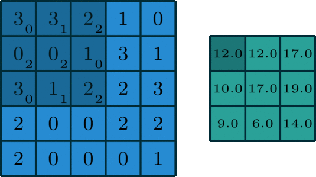
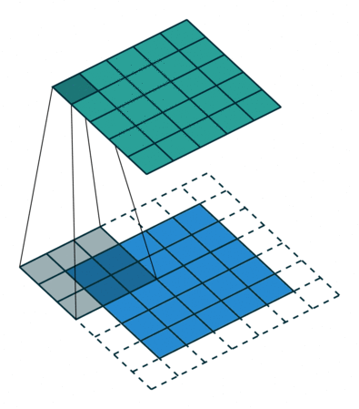

```{r setup}
#| message: false
#| warning: false
#| include: false

knitr::opts_chunk$set(
  fig.align = "center", fig.retina = 2, dpi = 150,
  out.width = "100%"
)

library(tidyverse)
library(rsample)
library(torch)
library(luz)
ggplot2::theme_set(ggplot2::theme_bw())

options(width = 70)
torch_manual_seed(1234)
```

```{r regression-recap}
#| include: false
set.seed(1234)
n = 10000; p = 20
X = matrix(rnorm(n * p), n, p)
true_beta = rep(0, p)
true_beta[c(3, 7, 12, 18)] = c(5.2, -3.1, 8.7, -1.5)
y = 3 + X %*% true_beta + rnorm(n)

lm_fit = lm(y ~ X)

Xt = torch_tensor(X, dtype = torch_float())
yt = torch_tensor(matrix(y, ncol = 1), dtype = torch_float())
```


## The abstraction ladder

We have walked up several layers of abstraction for fitting the same linear regression:

* Hand-coded gradient descent with an analytically derived gradient (`grad_desc_lm()`)

* `torch` tensors + autograd - we no longer need to derive the gradient by hand

* `nn_module` + `optim_sgd` - we no longer need to write the parameter update step

* `nn_linear` - we no longer need to manage the parameter tensors directly

* `luz` - we no longer need to write the training loop, batching, or metric tracking

Each layer trades a bit of explicitness for a lot of convenience (but less flexibility)


# `luz`

## What is `luz`?

[`luz`](https://mlverse.github.io/luz/) is a high-level training API built on top of `torch`. It removes most of the training-loop boilerplate we wrote in the previous lecture:

* Automatic batching via dataloaders

* Built-in metric tracking, validation splits, callbacks

* Early stopping, learning rate schedulers, checkpoints

* A built-in loss-curve plot

::: {.aside}
luz is roughly the R analogue of [PyTorch Lightning](https://lightning.ai/docs/pytorch/stable/) - the same `nn_module` we built by hand can be fit with luz with no changes.
:::


## A quick recap

Recall the 10000-row regression problem we fit by hand last lecture using `nn_linear` and a manual training loop:

::: {.xsmall}
```{r}
Xt$shape
yt$shape
coef(lm_fit) |> round(2)
deviance(lm_fit) |> round(2)
```
:::


## The luz workflow

::: {.columns}
::: {.column}
::: {.mxsmall}
```{r}
#| warning: false
#| message: false
#| code-line-numbers: "|2-9|10-13|14-15|16-24|17,19-22"
fitted = nn_module(
  initialize = function(in_features) {
    self$linear = nn_linear(in_features, 1)
  },
  forward = function(X) {
    self$linear(X)
  }
) |>
  setup(
    loss = nn_mse_loss(),
    optimizer = optim_sgd
  ) |>
  set_hparams(in_features = p) |>
  set_opt_hparams(lr = 0.05) |>
  fit(
    list(Xt, yt),
    epochs = 20,
    dataloader_options = list(
      batch_size = 100,
      shuffle = TRUE
    ),
    verbose = FALSE
  )
```
:::
:::
::: {.column .medium .fragment}
The four-stage pipeline maps directly onto things we wrote by hand:

* `setup()` - pick a loss function and optimizer

* `set_hparams()` - arguments passed to the model's `initialize()`

* `set_opt_hparams()` - arguments passed to the optimizer

* `fit()` - run the training loop, with batching and shuffling handled for us
:::
:::


## Inspecting the fit


::: {.xsmall}
```{r}
c(fitted$model$linear$bias, fitted$model$linear$weight) |> map(as.numeric) |> unlist() |> round(2)
lm_fit |> coef() |> round(2) |> unname()
```
:::

. . .

::: {.xsmall}
```{r}
fitted$records$metrics$train |> unlist() |> unname()
mean(lm_fit$residuals^2)
```
:::


## Loss curve from luz

::: {.xsmall}
```{r}
plot(fitted)
```
:::

::: {.aside}
`plot()` on a fitted luz model returns a `ggplot` object you can further customize.
:::


# MNIST

## The digits dataset

We will now take a look at the MNIST dataset - this variant comes from Python sklearn package and is available as a CSV file in `static/slides/data/mnist_digits.csv`. 

It contains 1797 8×8 grayscale images of handwritten digits.

::: {.xsmall}
```{r}
digits = readr::read_csv("data/mnist_digits.csv", show_col_types = FALSE)
dim(digits)
```
:::

. . .

::: {.xsmall}
```{r}
X = digits  |> select(-label) |> as.matrix()
y = digits$label
dim(X)
table(y)
```
:::


## Example digits

```{r}
#| echo: false
#| fig-width: 6
#| fig-height: 3
set.seed(1)
idx = sort(sample.int(nrow(X), 24))
par(mfrow = c(3, 8), mar = c(0, 0, 1.2, 0))
for (i in idx) {
  img = matrix(X[i, ], 8, 8, byrow = TRUE)
  image(
    t(img[8:1, ]),
    col = gray.colors(16, start = 1, end = 0),
    axes = FALSE, main = y[i]
  )
}
```


## Train / test split

::: {.xsmall}
```{r}
set.seed(1234)
split = initial_split(digits, prop = 0.8)

X_train = training(split) |> select(-label) |> as.matrix()
X_test  = testing(split)  |> select(-label) |> as.matrix()
y_train = training(split)$label
y_test  = testing(split)$label

dim(X_train); dim(X_test)
```
:::


## To torch tensors

::: {.xsmall}
```{r}
X_train_t = torch_tensor(X_train, dtype = torch_float())
y_train_t = torch_tensor(y_train + 1L, dtype = torch_long())
X_test_t  = torch_tensor(X_test,  dtype = torch_float())
y_test_t  = torch_tensor(y_test  + 1L, dtype = torch_long())
```
:::

. . .

::: {.xsmall}
```{r}
X_train_t$shape
y_train_t$shape
```
:::

::: {.aside}
R torch's `nn_cross_entropy_loss()` expects **1-based** class indices (the R convention), so we add 1 to the 0-9 digit labels before converting to a long tensor.
:::


## `nn_linear`

A quick refresher - `nn_linear(in_features, out_features)` implements the affine map

$$y = x W^\top + b$$

with a learnable weight matrix `W` of shape `(out_features, in_features)` and bias vector of length `out_features`. This is just a slightly funny way of writing a traditional regression model.

* Input shape: `(N, in_features)` - one row per example

* Output shape: `(N, out_features)` - one column per output unit

In our Regression model we used `out_features = 1` since we were trying to predict a single number. For our classification model we will use `out_features = 10` - one per class - and interpret the output as raw class scores (logits).


## A linear (multinomial) model

The following is the `torch` analogue of `nnet::multinom()` - a single `nn_linear` layer from 64 pixel features to 10 class scores, trained with cross-entropy loss.

::: {.xsmall}
```{r}
mnist_linear = nn_module(
  initialize = function() {
    self$linear = nn_linear(64, 10)
  },
  forward = function(x) {
    self$linear(x)
  }
)
```
:::


## Cross-entropy loss

For K-class classification the standard loss is *cross-entropy*. Given raw class scores (logits) $z = (z_1, \dots, z_K)$ from the model, we convert to class probabilities with the softmax

$$p_k = \frac{\exp(z_k)}{\sum_{j=1}^{K} \exp(z_j)}$$

and the loss for a single example with true class $y$ is the negative log-likelihood of the correct class

$$\ell(z, y) = -\log p_y = -z_y + \log \sum_{j=1}^{K} \exp(z_j).$$

Averaging over the mini-batch gives the objective that `nn_cross_entropy_loss()` minimizes.


## `nn_cross_entropy_loss()`

A few things to keep in mind when using it:

* The model's `forward()` should return raw logits, not probabilities - the softmax is fused into the loss for numerical stability.

* Targets are class indices (a `long` tensor), not a dummy coded / one-hot encoded matrix

* R torch uses 1-based indexing, so digit labels 0-9 become 1-10 (this is why we added 1 earlier).

::: {.xsmall}
```{r}
loss_fn = nn_cross_entropy_loss()
logits = torch_tensor(matrix(c(2.0, 0.5, -1.0, 0.1), nrow = 1))
target = torch_tensor(1L)
loss_fn(logits, target)
```
:::

. . .

::: {.xsmall}
```{r}
-log(exp(2.0) / sum(exp(c(2.0, 0.5, -1.0, 0.1))))
```
:::


## Fitting with luz

::: {.xsmall}
```{r}
#| code-line-numbers: "|2|3-7|9-15"
torch_manual_seed(1)
fitted_lin = mnist_linear |>
  setup(
    loss = nn_cross_entropy_loss(),
    optimizer = optim_sgd,
    metrics = list(luz_metric_accuracy())
  ) |>
  set_opt_hparams(lr = 0.05) |>
  fit(
    list(X_train_t, y_train_t),
    valid_data = list(X_test_t, y_test_t),
    epochs = 30,
    dataloader_options = list(batch_size = 64, shuffle = TRUE),
    verbose = FALSE
  )
```
:::

. . .


::: {.columns .xsmall}
::: {.column}
```{r}
get_metrics(fitted_lin) |> filter(set == "train") |> tail(4)
```
:::

::: {.column}
```{r}
get_metrics(fitted_lin) |> filter(set == "valid") |> tail(4)
```
:::
:::


## Linear model results


```{r}
#| echo: false
plot(fitted_lin)
```


## Actication layers

We're about to start building more complex models by stacking layers on top of each other. The issue is that if we just stack `nn_linear` layers, 
the whole thing collapses back down to a single linear transformation - no matter how many layers we add, the model is still just a linear model.

To solve this problem, we need to add a nonlinearity between the linear layers - an *activation function* that is applied element-wise to the output of each linear layer.

The two common choices:

* `nn_relu()` - Rectified Linear Unit: $f(x) = \max(0, x)$. Fast, sparse, and the default in most modern networks.

* `nn_tanh()` - Hyperbolic tangent: $f(x) = \tanh(x)$. Outputs in $(-1, 1)$, symmetric around zero.


## Activations in practice

::: {.xsmall}
```{r}
#| fig-width: 10
#| fig-height: 3.5
#| echo: false
x = torch_linspace(-3, 3, steps = 200)
relu_y = nnf_relu(x)
tanh_y = torch_tanh(x)

par(mfrow = c(1, 2), mar = c(4, 4, 2, 1))
plot(as.numeric(x), as.numeric(relu_y), type = "l", lwd = 2,
     main = "ReLU", xlab = "x", ylab = "f(x)")
abline(h = 0, v = 0, col = "grey", lty = 2)
plot(as.numeric(x), as.numeric(tanh_y), type = "l", lwd = 2,
     main = "tanh", xlab = "x", ylab = "f(x)")
abline(h = 0, v = 0, col = "grey", lty = 2)
```
:::

::: {.aside}
ReLU zeroes out negative inputs (creating sparsity), while tanh squashes everything to $(-1, 1)$. Both are applied element-wise to the output of a linear layer.
:::


## A feed-forward network

Now we'll build a model flexible model by introducing a hidden layer with 64 units and a ReLU activation.

::: {.xsmall}
```{r}
#| code-line-numbers: "|3-7"
mnist_fnn = nn_module(
  initialize = function(hidden = 64, activation = nn_relu) {
    self$net = nn_sequential(
      nn_linear(64, hidden),
      activation(),
      nn_linear(hidden, 10)
    )
  },
  forward = function(x) {
    self$net(x)
  }
)
```
:::


## Fitting the FNN

::: {.xsmall}
```{r}
torch_manual_seed(1)
fitted_fnn = mnist_fnn |>
  setup(
    loss = nn_cross_entropy_loss(),
    optimizer = optim_sgd,
    metrics = list(luz_metric_accuracy())
  ) |>
  set_hparams(hidden = 64, activation = nn_relu) |>
  set_opt_hparams(lr = 0.05) |>
  fit(
    list(X_train_t, y_train_t),
    valid_data = list(X_test_t, y_test_t),
    epochs = 50,
    dataloader_options = list(batch_size = 64, shuffle = TRUE),
    verbose = FALSE
  )
```
:::

. . .

::: {.columns .xsmall}
::: {.column}
```{r}
get_metrics(fitted_fnn) |> 
  filter(set == "train") |> tail(4)
```
:::

::: {.column}
```{r}
get_metrics(fitted_fnn) |> 
  filter(set == "valid") |> tail(4)
```
:::
:::

##

```{r}
#| echo: false
plot(fitted_fnn)
```


## Swapping the activation {.scrollable}

We can switch from ReLU to  `nn_tanh` in via `set_hparams()` without rewriting the model:

::: {.xsmall}
```{r}
torch_manual_seed(1)
fitted_tanh = mnist_fnn |>
  setup(
    loss = nn_cross_entropy_loss(),
    optimizer = optim_sgd,
    metrics = list(luz_metric_accuracy())
  ) |>
  set_hparams(hidden = 64, activation = nn_tanh) |>
  set_opt_hparams(lr = 0.05) |>
  fit(
    list(X_train_t, y_train_t),
    valid_data = list(X_test_t, y_test_t),
    epochs = 50,
    dataloader_options = list(batch_size = 64, shuffle = TRUE),
    verbose = FALSE
  )
```
:::

. . .

::: {.columns .xsmall}
::: {.column}
```{r}
get_metrics(fitted_tanh) |> 
  filter(set == "train") |> tail(4)
```
:::

::: {.column}
```{r}
get_metrics(fitted_tanh) |> 
  filter(set == "valid") |> tail(4)
```
:::
:::


# CIFAR10

## The CIFAR10 dataset

* 60,000 color images at 32×32 resolution

* 10 classes - airplane, automobile, bird, cat, deer, dog, frog, horse, ship, truck

* 50,000 training / 10,000 test split

* A standard benchmark for evaluating CNN architectures

Smaller brother to the CIFAR100 dataset (100 classes) and the ImageNet dataset (1000 classes, 224×224 resolution) - the latter was the standard benchmark for large-scale image classification.

::: {.aside}
Dataset [homepage](https://www.cs.toronto.edu/~kriz/cifar.html).
:::


## Loading the cached data

::: {.xsmall}
```{r}
train = readRDS("data/cifar10/train.rds")
test  = readRDS("data/cifar10/test.rds")

str(train, max.level = 1)
train$classes
```
:::

::: {.aside}
`x` is stored as an `integer` array of shape `(n, 3, 32, 32)` with pixel values in `0:255`. We will rescale to `[0, 1]` floats when building the tensors.
:::


## Example images

```{r}
#| echo: false
#| fig-width: 8
#| fig-height: 3
set.seed(2)
idx = sort(sample.int(dim(train$x)[1], 24))
par(mfrow = c(3, 8), mar = c(0, 0, 1.2, 0))
for (i in idx) {
  img = train$x[i, , , ] / 255
  img = aperm(img, c(2, 3, 1))
  plot(
    as.raster(img),
    main = train$classes[train$y[i]]
  )
}
```


## A custom `dataset()`

For datasets that don't fit neatly into an `(x, y)` tuple we define a `dataset()` class with `initialize`, `.getitem`, and `.length` methods - the R torch analogue of Python's `torch.utils.data.Dataset`:

::: {.xsmall}
```{r}
cifar10_dataset = dataset(
  name = "cifar10",
  initialize = function(data) {
    self$x = torch_tensor(data$x, dtype = torch_float()) / 255
    self$y = torch_tensor(data$y, dtype = torch_long())
  },
  .getitem = function(i) {
    list(x = self$x[i, , , ], y = self$y[i])
  },
  .length = function() {
    self$y$size(1)
  }
)
```
:::


## From dataset to dataloader

::: {.xsmall}
```{r}
train_ds = cifar10_dataset(train)
test_ds  = cifar10_dataset(test)

train_dl = dataloader(train_ds, batch_size = 128, shuffle = TRUE)
test_dl  = dataloader(test_ds,  batch_size = 128, shuffle = FALSE)

length(train_dl)
```
:::

. . .

::: {.xsmall}
```{r}
batch = train_dl$.iter()$.next()
batch$x$shape
batch$y$shape
```
:::

::: {.aside}
A dataloader is an iterator that yields one mini-batch per step - the training loop handles shuffling, and batching for us.
:::


## A CIFAR10 feed-forward model

As a baseline, we flatten each 32×32×3 image into a 3072-length vector and feed it through a two-hidden-layer network - the same approach we used for MNIST digits.

::: {.xsmall}
```{r}
cifar_fnn = nn_module(
  initialize = function() {
    self$net = nn_sequential(
      nn_flatten(),
      nn_linear(3 * 32 * 32, 512),
      nn_relu(),
      nn_linear(512, 128),
      nn_relu(),
      nn_linear(128, 10)
    )
  },
  forward = function(x) {
    self$net(x)
  }
)
```
:::


## Fitting the CIFAR10 FNN {.scrollable}

When the inputs are dataloaders, luz's `fit()` iterates over them directly - no `dataloader_options` needed.

::: {.xsmall}
```{r}
#| cache: true
torch_manual_seed(1)
fitted_cifar_fnn = cifar_fnn |>
  setup(
    loss = nn_cross_entropy_loss(),
    optimizer = optim_sgd,
    metrics = list(luz_metric_accuracy())
  ) |>
  set_opt_hparams(lr = 0.01) |>
  fit(
    train_dl,
    valid_data = test_dl,
    epochs = 50,
    verbose = FALSE
  )
```
:::

. . .

::: {.columns .xsmall}
::: {.column}
```{r}
get_metrics(fitted_cifar_fnn) |>
  filter(set == "train") |> tail(4)
```
:::

::: {.column}
```{r}
get_metrics(fitted_cifar_fnn) |>
  filter(set == "valid") |> tail(4)
```
:::
:::


##

```{r}
#| echo: false
plot(fitted_cifar_fnn)
```

::: {.aside}

:::

## 2D convolutions

The model we just used flattened all of the data which throws away all spatial structure - the model has no way to know that nearby pixels are related. This limits how well a fully connected network can do on image data.

:::: {.columns}
::: {.column width='50%'}
```{r}
#| echo: false

```
:::

::: {.column width='50%' .fragment}
```{r}
#| echo: false

```
:::
::::

::: {.aside}
Animation [source](https://towardsdatascience.com/intuitively-understanding-convolutions-for-deep-learning-1f6f42faee1)
:::


## `nn_conv2d`

A 2D convolutional layer slides a bank of learnable filters over the spatial dimensions of its input - the same filter weights are reused at every location:

`nn_conv2d(in_channels, out_channels, kernel_size, padding = 0, stride = 1)`

* Input: `(N, in_channels, H, W)` - batch of multi-channel images

* Output: `(N, out_channels, H', W')` - one feature map per output channel

* Parameters: `out_channels × (in_channels × kernel_size² + 1)`


## `nn_conv2d` in practice

::: {.xsmall}
```{r}
conv = nn_conv2d(in_channels = 3, out_channels = 8,
                 kernel_size = 3, padding = 1)
conv$weight$shape
conv$bias$shape
```
:::

. . .

::: {.xsmall}
```{r}
x = torch_randn(5, 3, 32, 32)
conv(x)$shape
```
:::

::: {.aside}
With `kernel_size = 3` and `padding = 1` the spatial dimensions are preserved; only the channel count changes (3 → 8).
:::


## Pooling

After a convolutional layer we typically *downsample* the features. Pooling layers summarize small spatial neighborhoods into a single value - this has no learnable parameters.

Why pool?

* Reduces spatial dimensions, cutting computation and memory for later layers

* Gives a degree of translation invariance - small shifts in the input produce the same pooled output

* Forces the network to learn coarser, more abstract features as we go deeper


## `nn_max_pool2d` and `nn_avg_pool2d`

The two common pooling operations over a 2×2 window:

* `nn_max_pool2d(kernel_size = 2)` - takes the maximum value in each window
* `nn_avg_pool2d(kernel_size = 2)` - takes the mean of values in each window

Both halve the spatial dimensions while leaving the channel count unchanged.

::: {.xsmall}
```{r}
x = torch_randn(5, 8, 32, 32)

nn_max_pool2d(kernel_size = 2)(x)$shape
nn_avg_pool2d(kernel_size = 2)(x)$shape
```
:::


## A CIFAR10 CNN

Directly adapted from the [PyTorch CIFAR10 tutorial](https://pytorch.org/tutorials/beginner/blitz/cifar10_tutorial.html) - two conv+pool blocks feeding into a 3-layer mlp with ReLU activations.

::: {.xsmall}
```{r}
#| code-line-numbers: "|4-6|7-9|10-14"
cifar_cnn = nn_module(
  initialize = function() {
    self$net = nn_sequential(       # (N, 3, 32, 32)
      nn_conv2d(3, 6, kernel_size = 5),  # -> (N, 6, 28, 28)
      nn_relu(),
      nn_max_pool2d(kernel_size = 2, stride = 2),  # -> (N, 6, 14, 14)
      nn_conv2d(6, 16, kernel_size = 5), # -> (N, 16, 10, 10)
      nn_relu(),
      nn_max_pool2d(kernel_size = 2, stride = 2),  # -> (N, 16, 5, 5)
      nn_flatten(),                      # -> (N, 400)
      nn_linear(16 * 5 * 5, 120),       # -> (N, 120)
      nn_relu(),
      nn_linear(120, 84),               # -> (N, 84)
      nn_relu(),
      nn_linear(84, 10)                 # -> (N, 10)
    )
  },
  forward = function(x) {
    self$net(x)
  }
)
```
:::


## Training the CNN {.scrollable}

::: {.xsmall}
```{r}
#| cache: true
torch_manual_seed(1)
fitted_cifar = cifar_cnn |>
  setup(
    loss = nn_cross_entropy_loss(),
    optimizer = optim_sgd,
    metrics = list(luz_metric_accuracy())
  ) |>
  set_opt_hparams(lr = 0.01) |>
  fit(
    train_dl,
    valid_data = test_dl,
    epochs = 50,
    verbose = FALSE
  )
```
:::

. . .

::: {.columns .xsmall}
::: {.column}
```{r}
get_metrics(fitted_cifar) |>
  filter(set == "train") |> tail(4)
```
:::

::: {.column}
```{r}
get_metrics(fitted_cifar) |>
  filter(set == "valid") |> tail(4)
```
:::
:::


##

```{r}
#| echo: false
plot(fitted_cifar)
```

# Going further - VGG16

## The VGG16 model

:::: {.small}
[VGG16](https://arxiv.org/abs/1409.1556) was state of the art on ImageNet in 2014. It is a simple repeating pattern of `Conv → BatchNorm → ReLU` blocks interleaved with max pooling, finished with a single linear layer. Implementing it is short - `make_layers()` walks a config list and builds the sequential model for us.
::::

::: {.xxsmall}
```{r}
#| eval: false
vgg16 = nn_module(
  initialize = function() {
    cfg = c(64, 64, "M", 128, 128, "M", 256, 256, 256, "M",
            512, 512, 512, "M", 512, 512, 512, "M")
    in_channels = 3
    layers = list()
    for (x in cfg) {
      if (x == "M") {
        layers[[length(layers) + 1]] = nn_max_pool2d(kernel_size = 2, stride = 2)
      } else {
        x = as.integer(x)
        layers[[length(layers) + 1]] = nn_conv2d(in_channels, x,
                                                 kernel_size = 3, padding = 1)
        layers[[length(layers) + 1]] = nn_batch_norm2d(x)
        layers[[length(layers) + 1]] = nn_relu(inplace = TRUE)
        in_channels = x
      }
    }
    layers[[length(layers) + 1]] = nn_flatten()
    layers[[length(layers) + 1]] = nn_linear(512, 10)
    self$net = do.call(nn_sequential, layers)
  },
  forward = function(x) {
    self$net(x)
  }
)
```
:::

::: {.aside}
Based on code from [pytorch-cifar](https://github.com/kuangliu/pytorch-cifar) - this was state of the art in ~2014.
:::


## Fitting VGG16

On a laptops, each epoch of VGG16 on the full CIFAR10 training set takes several minutes on CPU. The code below would produce roughly the following loss / accuracy with `lr = 0.01`:

::: {.panel-tabset}

### Code

::: {.xsmall}
```{r}
#| eval: false
torch_manual_seed(1)
fitted_vgg = vgg16 |>
  setup(
    loss = nn_cross_entropy_loss(),
    optimizer = optim_sgd,
    metrics = list(luz_metric_accuracy())
  ) |>
  set_opt_hparams(lr = 0.01) |>
  fit(
    train_dl,
    valid_data = test_dl,
    epochs = 10
  )
```
:::

### Output

::: {.xsmall}
```
Epoch  1 | train loss: 1.345 | valid loss: 1.102 | train acc: 0.512 | valid acc: 0.621
Epoch  2 | train loss: 0.790 | valid loss: 0.812 | train acc: 0.726 | valid acc: 0.714
Epoch  3 | train loss: 0.577 | valid loss: 0.731 | train acc: 0.800 | valid acc: 0.751
Epoch  4 | train loss: 0.445 | valid loss: 0.669 | train acc: 0.844 | valid acc: 0.781
Epoch  5 | train loss: 0.350 | valid loss: 0.701 | train acc: 0.878 | valid acc: 0.782
Epoch  6 | train loss: 0.274 | valid loss: 0.647 | train acc: 0.904 | valid acc: 0.803
Epoch  7 | train loss: 0.215 | valid loss: 0.668 | train acc: 0.925 | valid acc: 0.809
Epoch  8 | train loss: 0.167 | valid loss: 0.664 | train acc: 0.941 | valid acc: 0.822
Epoch  9 | train loss: 0.127 | valid loss: 0.710 | train acc: 0.955 | valid acc: 0.824
Epoch 10 | train loss: 0.103 | valid loss: 0.703 | train acc: 0.964 | valid acc: 0.832
```
:::

:::

## Where to go next

* [`torch`](https://torch.mlverse.org) - the full low-level API. Everything we have done translates one-for-one with PyTorch documentation.

* [`luz`](https://mlverse.github.io/luz/) - higher-level training, callbacks, early stopping, learning-rate schedulers, checkpointing.

* [`torchvision`](https://torchvision.mlverse.org) - image datasets, transforms, and a growing set of pretrained models (ResNet, VGG, EfficientNet, ...).

* [`torchdatasets`](https://mlverse.github.io/torchdatasets/) - a growing set of tabular and vision datasets with ready-made `dataset()` classes.

* GPU support - everything here runs unchanged on a CUDA-capable machine; tensors and modules are moved with `$to(device = "cuda")`.

  * Departmental Servers have 2x NVidia A4000 GPUs each and you are welcome to make use of them for learning purposes
